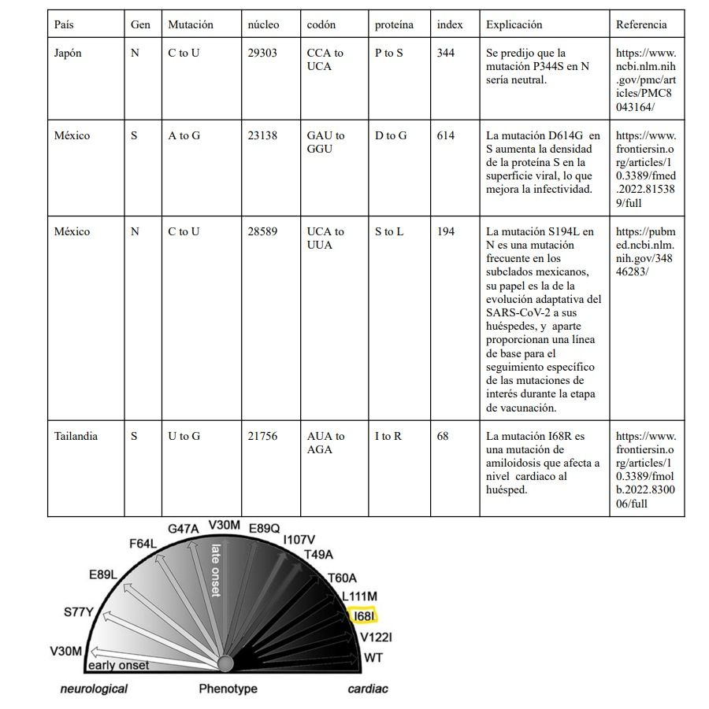

### Repositorio:
[GitHub Repository](https://github.com/TonyNogueron/sars-cov-2-analysis)

### Introducción: 

A finales de 2019 la ciudad de Wuhan, en la provincia de Hubei (una ciudad de China con más de 11 millones de habitantes), se convirtió en el centro de una epidemia de neumonía de causa desconocida con implicaciones globales.

En enero de 2020, la Organización Mundial de la Salud (OMS) declaró el brote de la enfermedad por el nuevo coronavirus SARS-CoV-2 (COVID-19) como una emergencia de salud pública de importancia internacional. En marzo de 2020, caracterizó el COVID-19 como una pandemia. Desde entonces la OMS y las autoridades de salud pública de todo el mundo están actuando para contener el brote, que ha implicado desafíos antes impensados para las personas, las comunidades y las instituciones.

Esta pandemia puede ser considerada como el primer gran impacto de repercusión planetaria en la historia reciente del mundo globalizado. Aunque sus efectos en materia de salud pública están siendo superlativos, también lo son en todos los demás ámbitos de la vida pública y privada, individual y colectiva. Como es el caso en la mayoría de los procesos naturales, sus oportunidades o contingencias asociadas dependen del modelo de desarrollo en el que se produzcan. Con la pandemia, esto se ha puesto más en evidencia.

Se sabe que las pruebas serológicas son una herramienta muy útil para confirmar la infección por un patógeno en la población y, combinadas con datos epidemiológicos y clínicos, permiten estimar la gravedad y la transmisibilidad del patógeno e identificar los grupos de población que han sido infectados, así como aquellos que siguen siendo susceptibles.  Por ello, cada vez más requerimos datos moleculares como las secuencias de ácidos nucleicos de los virus para conocer su origen y potencialidad epidemiológica.

### Problema:

El SARS-CoV-2 es un virus que causa una enfermedad respiratoria llamada enfermedad por coronavirus de 2019 (COVID-19).
El SARS-CoV-2 es un virus de la gran familia de los coronavirus.
Los coronavirus infectan a seres humanos y algunos animales.
La infección por el SARS-CoV-2 en las personas se identificó por primera vez en 2019.
Se piensa que este virus se transmite de una persona a otra en las gotitas que se dispersan cuando la persona infectada tose, estornuda o habla.
Es posible que también se transmita por tocar una superficie con el virus y luego llevarse las manos a la boca, la nariz o los ojos, aunque esto es menos frecuente.
Hay estudios de investigación en curso sobre el tratamiento de la COVID-19 y la prevención de la infección por el SARS-CoV-2.
También se llama coronavirus 2019-nCoV, coronavirus del síndrome respiratorio agudo grave de tipo 2 y CoV-SRAG-2.

Sabemos que un virus al contagiarse y replicarse numerosas veces, tiene la posibilidad de mutar y generar un cambio en su ADN.
A la hora de hacer el proceso de la replicación, es posible que haya cambios a la hora de copiar el genoma de los virus de generaciones anteriores.
Es decir, mientras más contagios haya, las posibilidades de tener mutaciones son mayores y se van distanciando del genoma original, ya sea para el bien del virus, o del organismo hospedante.

Sabemos que el SARS-CoV-2 es un virus increíblemente contagioso y peligroso. Un año después de que empezó la pandemia, se empezaron a crear y distribuir vacunas; sin embargo, el virus no desapareció y la pandemia persistió gracias a que había personas que no querían vacunarse o no había suficientes vacunas para la población. El virus empezó a mutar y se volvió más resistente a las primeras vacunas.

Es gracias a estas mutaciones que han surgido variantes de preocupación como Delta y Omicrón. Una variante es un código genético que puede tener una o más mutaciones, y una de preocupación es aquella que puede ser más transmisible, mortal, y que además, puede poner en riesgo la efectividad de las herramientas médicas actuales para combatir al virus.

### Antecedentes:

#### **Cronología del Covid:**

##### **31 de diciembre de 2019**
La Oficina de la OMS en la República Popular China detecta una declaración de la Comisión Municipal de Salud de Wuhan para los medios de comunicación publicada en su sitio web en la que se mencionan casos de una «neumonía vírica» en Wuhan (República Popular China).

##### **13 de enero de 2020**
El Ministro de Salud Pública de Tailandia notifica un caso del nuevo coronavirus confirmado en laboratorio importado desde Wuhan, el primer caso registrado fuera de la República Popular China.

##### **16 de enero de 2020**
El Ministerio de Salud, Trabajo y Bienestar del Japón notifica a la OMS un caso confirmado de infección por el nuevo coronavirus en una persona que había viajado a Wuhan. Es el segundo caso confirmado detectado fuera de la República Popular China.

##### **21 de enero de 2020**
Los Estados Unidos de América (EE.UU.) notifican su primer caso confirmado de infección por el nuevo coronavirus. Se trata del primer caso en la Región de las Américas de la OMS. El hombre había viajado a Wuhan.

##### **24 de enero de 2020**
Francia notifica a la OMS tres casos de infección por el nuevo coronavirus, todos de personas que habían viajado desde Wuhan. Se trata de los primeros casos confirmados en la Región de Europa de la OMS (EURO).

##### **29 de enero de 2020**
Los Emiratos Árabes Unidos notifican los primeros casos en la Región del Mediterráneo Oriental.

##### **14 de febrero de 2022**
Egipto anuncia su primer caso de coronavirus de Wuhan, según un comunicado conjunto del Ministerio de Salud de Egipto y la OMS. Es el primer caso confirmado en África desde que se detectó el virus.

##### **25 de febrero de 2020**
Confirmación del primer caso en la Región de África de la OMS, en Argelia. Este caso llega después de la notificación previa de un caso en Egipto, el primero en el continente africano. Fue un hombre que había viajado a Italia.

##### **28 de febrero de 2020**
El primer caso fue detectado en Ciudad de México. Un hombre de 35 años que había visitado recientemente el norte de Italia.


### Propuesta:

Analizar el progreso de una de las variantes del SARS-CoV-2 a través del mundo hasta llegar a México; esto mediante el análisis de las mutaciones de la variante en distintos genomas recopilados en distintos países. Al identificar las mutaciones más relevantes y recurrentes, investigar las repercusiones de las mutaciones y ligarlas con las noticias sobre el progreso del virus.

### Hipótesis:

#### Hipótesis 1:
El virus original del SARS-CoV-2 de Wuhan no sufrió ninguna mutación en sus genes más importantes (S, E, M, N) al propagarse a los siguientes países de interés: Estados Unidos, México, Italia, Japón, Tailandia y Francia.

#### Hipótesis 2:
El virus 2 meses después de haber llegado a los países de interés, tendrá una cantidad más significante de mutaciones, incluso llegando a crear nuevas variantes del virus.


### Proceso:

Para realizar el análisis de las mutaciones, lo primero que ncesitamos es importar las librerías que nos serán de utilidad para el análisis y graficación de las secuencias. 

```{r echo=T, results = 'hide'}
library(seqinr,warn.conflicts=F, quietly=T)
library(ggplot2,warn.conflicts=F, quietly=T)
library(dplyr,warn.conflicts=F, quietly=T)
```

Luego de importar las librerías, es necesario leer el archivo donde se encuentra la secuencia original de Wuhan, la cual tomaremos como referencia para los análisis.

```{r echo=TRUE}
original = read.fasta("Archivos/Wuhan_coding_sequences.txt")
```

Ahora creamos el Data Frame donde cuardaremos la información que resulte de nuestros análisis. Este tiene el País, el gen, cambio de nucleótido, índice donde sucede la mutación, el cambio de codón, de aminoácido, el índice del codón del cambio, si la mutación genera un cambio en el aminoácido y la referencia de donde fue comparada la secuencia.

```{r echo=TRUE}
df = data.frame(
  pais = character(),
  gen = character(),
  mutation = character(),
  nucleo = numeric(),
  codon = character(),
  protein = character(),
  index = numeric(),
  protein_change = logical(),
  compared_to = character()
)
```

```{r include=FALSE}
abreviatura = function(codon){
  return(switch(codon,"GAC"="D","GAU"="D",
                "GAA"="E","GAG"="E",
                "CGA"="R","CGC"="R","CGG"="R","CGU"="R","AGA"="R","AGG"="R",
                "AAA"="K","AAG"="K",
                "AAC"="N","AAU"="N",
                "CAC"="H","CAU"="H",
                "CAA"="Q","CAG"="Q",
                "UCA"="S","UCC"="S","UCG"="S","UCU"="S","AGC"="S","AGU"="S",
                "ACA"="T","ACC"="T","ACG"="T","ACU"="T",
                "GCA"="A","GCC"="A","GCG"="A","GCU"="A",
                "GGA"="G","GGC"="G","GGG"="G","GGU"="G",
                "GUA"="V","GUC"="V","GUG"="V","GUU"="V",
                "CCA"="P","CCC"="P","CCG"="P","CCU"="P",
                "CUA"="L","CUC"="L","CUG"="L","CUU"="L","UUA"="L","UUG"="L",
                "UUC"="F","UUU"="F",
                "UAC"="Y","UAU"="Y",
                "AUA"="I","AUC"="I","AUU"="I",
                "AUG"="M",
                "UGG"="W",
                "UGC"="C","UGU"="C",
                codon))
}

adn_to_arnm = function(elemento){
  return (switch(elemento,"C"="C","G"="G","A"="A","T"="U"))
}

Alineacion = function(A,B){
  m <- matrix(data = 0, nrow = length(B)+1, ncol = length(A)+1)
  m[1, ] = seq(0,length(A)*-2,-2)
  m[ , 1] = seq(0,length(B)*-2,-2)
  m
  
  for (fila in seq(2,length(B)+1)){
    for (col in seq(2,length(A)+1)){
      m[fila, col] = CalcularPeso(A,B,fila, col, m)
    }
  }
  
  #back-trace
  
  iFila = length(B) + 1
  iColumna = length(A) + 1
  A_res = c()
  B_res = c()
  
  while (iFila != 1 && iColumna != 1){
    if(A[iColumna-1] == B[iFila-1]){
      A_res = append(A_res,A[iColumna-1])
      B_res = append(B_res,A[iColumna-1])
      iColumna = iColumna - 1
      iFila = iFila - 1
    } else {
      if(m[iFila, iColumna-1] > m[iFila-1, iColumna]){
        A_res = append(A_res, A[iColumna-1])
        B_res = append(B_res, "-")
        iColumna = iColumna - 1
      } else { 
        A_res = append(A_res, "-")
        B_res = append(B_res, B[iFila-1])
        iFila = iFila - 1
      }
    }
  }
  resultado = c(rev(A_res),rev(B_res))
  return(resultado)
}

CalcularPeso = function(A, B, fila,col,m){
  if(A[col-1] == B[fila-1]){
    diagonal = m[fila-1,col-1] + 1
  } else {
    diagonal = m[fila-1,col-1] - 1
  }
  up = m[fila-1, col] -2
  left = m[fila, col-1] -2
  peso = max(diagonal,up,left)
  return(peso)
}
```

Para realizar el análisis que llenará el Data Frame, creamos la función Mutaciones, que recibe como parámetros la secuencia original, un vector con el nombre de los países a analizar, para acceder por nombre a los archivos de las secuencias previamente recopilados. Un vector con el nombre de los genes que queremos analizar, el nombre del archivo y si es continuo o no para las secuencias múltiples en un solo archivo.

Primero convierte las secuencias de ADN a ARN mensajero cambiando las Timinas por Uracilos directamente. En el proceso biológico se haría un cambio de ADN a ADN complementario cambiando A->T, T->A, G->C, y C->G, después del ADN complementario para el ARN mensajero sería A->U, T->A, G->C, y C->G en realidad del ADN al ARNm solo cambian las Timinas por uracilos. Luego da un formato a las letras y las pasa a mayúsculas para tener más facilidad a la hora de hacer el análisis y evitar errores.

Después se lleva el proceso del análisis donde detecta si un nucleótido difiere entre las 2 secuencias y si ese es el caso analiza que cambión, los índices del cambio, si hubo un cambio en el codón, que aminoácido cambió y si esa mutación tuvo repercusión en el aminoácido, toda esta información se agrega al Data Frame.

```{r echo=TRUE}
Mutaciones = function(original, vector_paises, vector_genes_wuhan, vector_genes, file_name, continuo){
  for (p in seq (1,length(vector_paises),1)) {
    mexican = read.fasta(paste(c(file_name,vector_paises[p],".txt"),collapse=""))
    gr = 1
    while(gr<=length(vector_genes)) {    

      genWuhan = original[[vector_genes_wuhan[gr]]]
      genWuhan = toupper(genWuhan)
      genWuhan = as.vector(sapply(genWuhan,adn_to_arnm))
      
      
      for (find_gen in seq(1,12,1)) {
        genMexico = mexican[[find_gen]]
        attr1 = attr(genMexico,"Annot")
        vec = unlist(strsplit(attr1,"\\[|\\]|:|=|\\."))
        gen = vec[which(vec=="gene")+1]
        if (gen==vector_genes[gr]) {
          g = find_gen
          inicio = as.integer(vec[which(vec=="location")+1])-1
          break
        }
      }
      
      
      for(k in seq(g,length(mexican),12)){
        genMexico = mexican[[k]]      
        genMexico = toupper(genMexico)
        genMexico = as.vector(sapply(genMexico,adn_to_arnm))
        
        #Check if there is an insertion or deletion mutation
        if(length(genMexico)!=length(genWuhan)){
           genesAlineados = Alineacion(genWuhan,genMexico)
           genWuhan = genesAlineados[1]
           genMexico = genesAlineados[2]
         }
        
        
        for(i in seq(1, min(c(length(genMexico), length(genWuhan))), 1)){
          if(genWuhan[i] != genMexico[i]){
            codonIndex = as.integer((i) %/% 3) + 1 
            codonWuhan = paste(c(genWuhan[((codonIndex*3)-2):(codonIndex*3)]), collapse = "")
            codonMexico = paste(c(genMexico[((codonIndex*3)-2):(codonIndex*3)]), collapse = "")
            
            if (abreviatura(codonWuhan)==abreviatura(codonMexico)) {
              cambio = FALSE
            } else {
              cambio = TRUE
            }
            
            df[nrow(df)+1, 1] = vector_paises[p]
            df[nrow(df), 2] = gen
            df[nrow(df), 3] = paste(c(genWuhan[i],genMexico[i]),collapse = " to ")
            df[nrow(df), 4] = i + inicio
            df[nrow(df), 5] = paste(c(codonWuhan,codonMexico), collapse = " to ") 
            df[nrow(df), 6] = paste(c(abreviatura(codonWuhan), abreviatura(codonMexico)), collapse = " to ")
            df[nrow(df), 7] = codonIndex
            df[nrow(df), 8] = cambio
            
            if (continuo && p>1) {
              df[nrow(df), 9] = paste(c("Mexico ",p),collapse="")
            } else {
              df[nrow(df), 9] = "Wuhan"
            }
          }
        }
      }
      gr = gr + 1
    }
    
    if (continuo) {
      original = mexican
    }
    
    
  }
  return(df)
}
```
Aquí creamos los vectores de información que necesitará la función para el análisis

```{r echo=TRUE}
vector_paises = c("Francia","Tailandia","Japon","Italia","USA","Mexico")
vector_genes_wuhan = c(3,5,6,11)
vector_genes = c("S","E","M","N")
vector_num_genomas = c(1,2,3)
file_names_first = "Archivos/first_B_sequences/first_B_"
file_names_months = "Archivos/2Meses_Despues_sequences/2Meses_Despues_"
file_names_multiple = "Archivos/Mexico_multiple/Mexico_"
```
Después utilizamos nuestra función para hacer el análisis de las primeras secuencias del virus SARS-CoV-2, el original con Pango B para comprobar nuestra hipótesis.

```{r echo=TRUE}
dataFrame_genS = Mutaciones(original,vector_paises,vector_genes_wuhan,vector_genes,file_names_first,FALSE)

dataFrame_2months_later = Mutaciones(original,vector_paises,vector_genes_wuhan,vector_genes,file_names_months,FALSE)

dataFrame_mexico = Mutaciones(original,vector_num_genomas,vector_genes_wuhan,vector_genes,file_names_multiple,TRUE)
```

Aquí podemos ver el Data Frame de las mutaciones encontradas en las primeras secuencias encontradas en 6 países
```{r echo=FALSE}
dataFrame_genS

```
Luego con las mutaciones en esos países 2 meses después
```{r echo=FALSE}
dataFrame_2months_later

```
Por último varias mutaciones encontradas en secuencias de México
```{r echo=FALSE}
dataFrame_mexico
```

Luego creamos una función que grafique información del DataFrame. En este caso recibe el Data Frame, la columna del Data Frame del cual queremos el análisis, y por último las etiquetas de la gráfica.

```{r echo=TRUE}
graficar = function(df,columna,titulo,xlabel,ylabel,llenado){
  p = ggplot(df)
  p = p + aes(x=reorder(factor(columna),columna, function(x) -length(x)), fill = columna, label = after_stat(count))
  p = p + ggtitle(titulo)
  p = p + labs(x=xlabel, y = ylabel, fill = llenado)
  p = p + geom_bar(stat = "count")
  p = p + geom_text(stat = "count", vjust = 1)
  p
}
```
Usando esta función pedimos al programa que grafique los cambios en nucleótidos y aminoácidos de nuestros data frames.

```{r}
graficar(dataFrame_genS,dataFrame_genS$mutation, "Mutaciones de Sustitución (Primeros Casos)","Mutación","Frecuencia","Mutaciones")

graficar(dataFrame_genS,dataFrame_genS$protein, "Cambios de aminoácidos (Primeros Casos)","Cambio","Frecuencia","Cambios")

graficar(dataFrame_2months_later,dataFrame_2months_later$mutation, "Mutaciones de Sustitución (2 meses después)","Mutación","Frecuencia","Mutaciones")

graficar(dataFrame_2months_later,dataFrame_2months_later$protein, "Cambios de aminoácidos (2 meses después)","Cambio","Frecuencia","Cambios")

graficar(dataFrame_mexico,dataFrame_mexico$mutation, "Mutaciones de Sustitución (México)","Mutación","Frecuencia","Mutaciones")
```

Por último, para graficar los cambios en aminoácidos de México, puesto que el Data Frame es muy grande y solo queremos las primeras 15 columnas con más frecuencia, tuvimos que filtrar los datos.

```{r echo=TRUE}
#Graficar solo las 15 columnas con más frecuencia
df2 = filter(
  summarise(
    select(
      group_by(dataFrame_mexico, protein),
    ),
    count = n()
  ),
  count > 0
)
df2 = df2[order(-df2$count), ]
df2 = df2[1:15, ]

p = ggplot(df2)
p = p + aes(x=reorder(protein,-count), y=count, fill=protein, label=count)
p = p + ggtitle("Cambios de aminoácidos en México (primeras 15 columnas)")
p = p + labs(x="Cambio", y="Frecuencia", fill="Cambios")
p = p + geom_bar(stat = "identity") 
p = p + geom_text(stat = "identity", vjust = 1)
p

```

Aquí podemos ver un poco de la investigación realizada sobre las primeras mutaciones encontradas con el análisis



### Conclusiones:

En conclusión, podemos observar que nuestras dos hipótesis son correctas. Al analizar los primeros genomas de cada país, podemos ver que no existen mutaciones en ellas. Las únicas mutaciones que vemos en la tabla es una de Japón y dos de México. Tras nuestra investigación, sabemos que la mutación de Japón no causa efectos en el virus. Para el genoma de México es importante recordar que el virus llegó desde Italia, no directamente de Wuhan, es por ello que vemos dos mutaciones importantes que sí cambian al virus, especialmente en el aspecto de infectividad como lo es para el caso de la mutación D614G. Esta mutación fue de las primeras más importantes y permanentes en el virus ya que lo volvió más fuerte. Todos los genomas actuales del virus contienen esta mutación.

Por todo lo anterior, podemos establecer que prácticamente no hubo mutaciones en los genes estructurales cuando el virus viajó directamente de Wuhan a los otros países estudiados, la única excepción siendo Japón. Además, podemos establecer una hipótesis para futuros análises la cual es: "El virus sufrió 2 o más mutaciones estructurales importantes al viajar de un país secundario a uno terciario".


Lamentablemente, no se puede concluir con certeza que nuestra segunda hipótesis es correcta, ya que aunque sí podemos ver que dos meses después sí hay más mutaciones, estas no son realmente significantes ni sabemos si son lo suficientemente mortales para crear una variante. Para determinar si las mutaciones encontradas tienen el poder de crear una variante, sería necesario comparar los genomas con algunas variantes conocidas como Alpha, Omicron y Delta.
Sin embargo, sí pudimos observar que en países que había llegado con mutaciones, dos meses después ya tenían una o dos. Es interesante ver que aunque el virus se propaga muy rápido, dos meses es un periodo de tiempo muy corto para realmente tener una cantidad de mutaciones significante.


### Datasets:

2019-12 - Genoma Original Wuhan: https://www.ncbi.nlm.nih.gov/nuccore/NC_045512

2020-01-22 - Primer Genoma B Estados Unidos: https://www.ncbi.nlm.nih.gov/nuccore/MN994468
2020-03-25 - Primer Genoma B.1 México: https://www.ncbi.nlm.nih.gov/nuccore/MT810786
2020-01-30 - Primer Genoma B Italia: https://www.ncbi.nlm.nih.gov/nuccore/MT509662
2020-01 - Primer Genoma B Japón: https://www.ncbi.nlm.nih.gov/nuccore/LC529905
2020-01-08 - Primer Genoma B Tailandia: https://www.ncbi.nlm.nih.gov/nuccore/MT447155
2020-03 - Primer Genoma B Francia: https://www.ncbi.nlm.nih.gov/nuccore/MT470129

2020-03-30 - Genoma B Dos Meses Después Estados Unidos: https://www.ncbi.nlm.nih.gov/nuccore/MT772557
2020-03-30 - Genoma B.1 Dos Meses Después México: https://www.ncbi.nlm.nih.gov/nuccore/OK435602
2020-03-23 - Genoma B.1 Dos Meses Después Italia: https://www.ncbi.nlm.nih.gov/nuccore/MT509655
2020-03 - Genoma B Dos Meses Después Japón: https://www.ncbi.nlm.nih.gov/nuccore/LC542809
2020-03-03 - Genoma B Dos Meses Después Tailandia: https://www.ncbi.nlm.nih.gov/nuccore/MT781414
2020-03 - Genoma B Dos Meses Después Francia: https://www.ncbi.nlm.nih.gov/nuccore/MT470129


2021-05-01 - Genoma A.2.5 México: https://www.ncbi.nlm.nih.gov/nuccore/ON316653
2020-05-15 - Genoma B.1 México: https://www.ncbi.nlm.nih.gov/nuccore/OM000280
2020-05-30 - Genoma B.1.595 México: https://www.ncbi.nlm.nih.gov/nuccore/OM181179

### Bibliografía:

Word Health Organization. (2020). WHO Statement regarding cluster of pneumonia cases in Wuhan, China. Recuperado de: https://www.who.int/china/news/detail/09-01-2020-who-statement-regarding-cluster-of-pneumonia-cases-in-wuhan-china

Word Health Organization. (2020). WHO Director-General's remarks at the media briefing on 2019-nCoV on 11 February 2020. Recuperado de: https://www.who.int/dg/speeches/detail/who-director-general-s-remarks-at-the-media-briefing-on-2019-ncov-on-11-february-2020

COVID-19: Problemas sociales y psicológicos en la pandemia. (2020, 16 diciembre). UNESCO. Recuperado 30 de abril de 2022, de https://es.unesco.org/news/covid-19-problemas-sociales-y-psicologicos-pandemia#:%7E:text=Ella%20constituye%20una%20situaci%C3%B3n%20disruptiva,de%20bienes%2C%20o%20del%20empleo.

Cronología de la respuesta de la OMS a la COVID-19‎. (2020, 29 junio). Organización Mundial de la Salud. Recuperado 30 de abril de 2022, de https://www.who.int/es/news/item/29-06-2020-covidtimeline