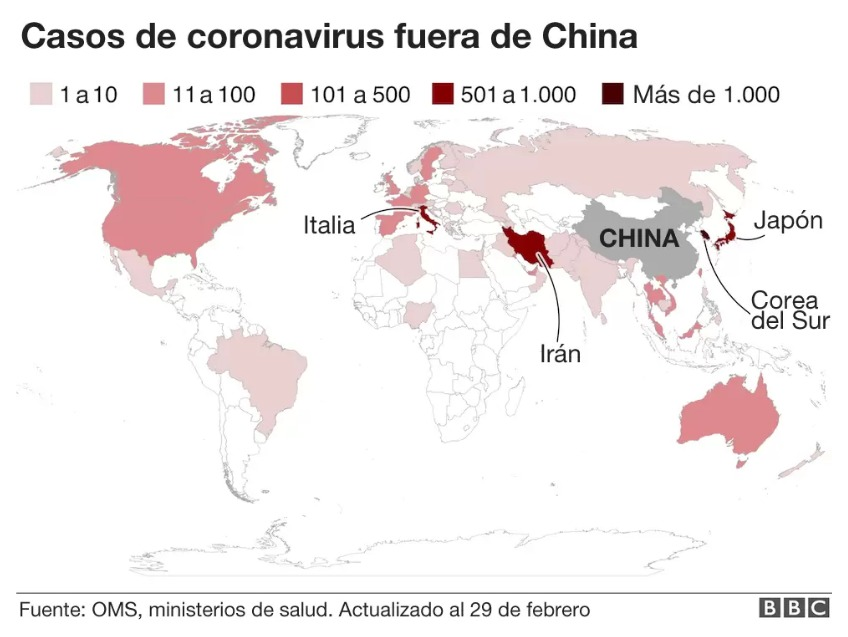
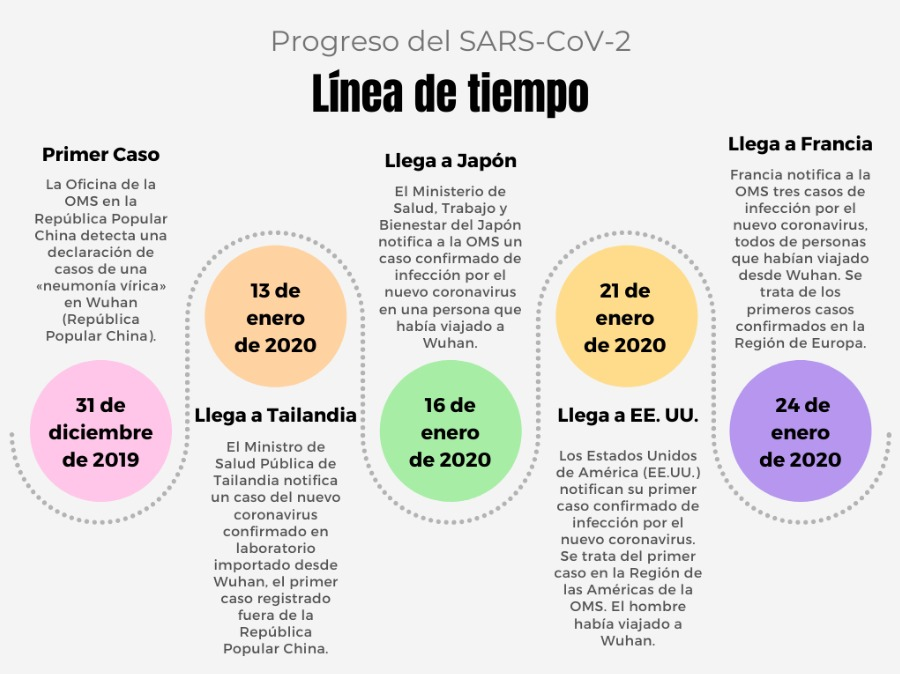
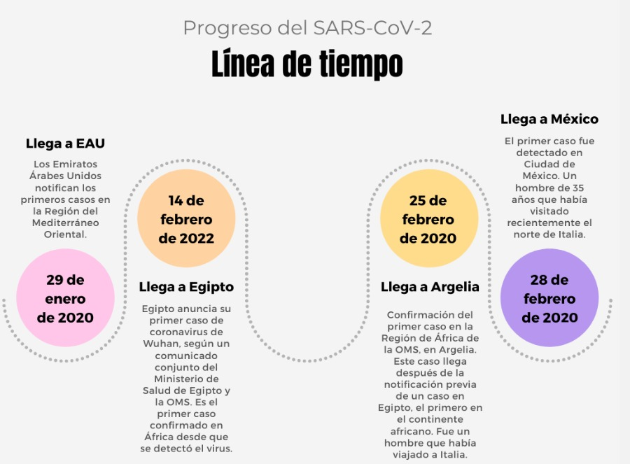
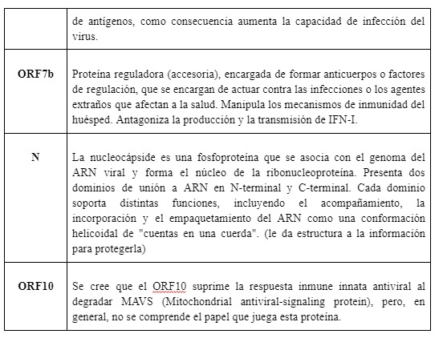
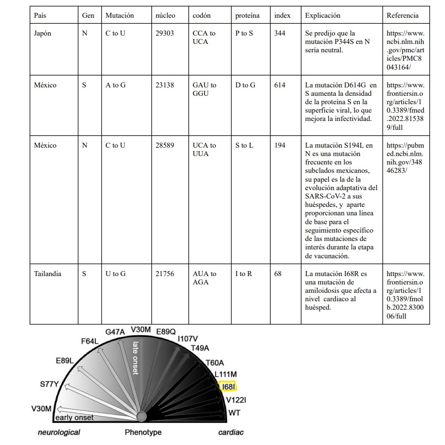

### Introducción: 

A finales de 2019 la ciudad de Wuhan, en la provincia de Hubei (una ciudad de China con más de 11 millones de habitantes), se convirtió en el centro de una epidemia de neumonía de causa desconocida con implicaciones globales.

En enero de 2020, la Organización Mundial de la Salud (OMS) declaró el brote de la enfermedad por el nuevo coronavirus SARS-CoV-2 (COVID-19) como una emergencia de salud pública de importancia internacional. En marzo de 2020, caracterizó el COVID-19 como una pandemia. Desde entonces la OMS y las autoridades de salud pública de todo el mundo están actuando para contener el brote, que ha implicado desafíos antes impensados para las personas, las comunidades y las instituciones.

Esta pandemia puede ser considerada como el primer gran impacto de repercusión planetaria en la historia reciente del mundo globalizado. Aunque sus efectos en materia de salud pública están siendo superlativos, también lo son en todos los demás ámbitos de la vida pública y privada, individual y colectiva. Como es el caso en la mayoría de los procesos naturales, sus oportunidades o contingencias asociadas dependen del modelo de desarrollo en el que se produzcan. Con la pandemia, esto se ha puesto más en evidencia.

Se sabe que las pruebas serológicas son una herramienta muy útil para confirmar la infección por un patógeno en la población y, combinadas con datos epidemiológicos y clínicos, permiten estimar la gravedad y la transmisibilidad del patógeno e identificar los grupos de población que han sido infectados, así como aquellos que siguen siendo susceptibles.  Por ello, cada vez más requerimos datos moleculares como las secuencias de ácidos nucleicos de los virus para conocer su origen y potencialidad epidemiológica.

### Problema:

El SARS-CoV-2 es un virus que causa una enfermedad respiratoria llamada enfermedad por coronavirus de 2019 (COVID-19).
El SARS-CoV-2 es un virus de la gran familia de los coronavirus.
Los coronavirus infectan a seres humanos y algunos animales.
La infección por el SARS-CoV-2 en las personas se identificó por primera vez en 2019.
Se piensa que este virus se transmite de una persona a otra en las gotitas que se dispersan cuando la persona infectada tose, estornuda o habla.
Es posible que también se transmita por tocar una superficie con el virus y luego llevarse las manos a la boca, la nariz o los ojos, aunque esto es menos frecuente.
Hay estudios de investigación en curso sobre el tratamiento de la COVID-19 y la prevención de la infección por el SARS-CoV-2.
También se llama coronavirus 2019-nCoV, coronavirus del síndrome respiratorio agudo grave de tipo 2 y CoV-SRAG-2.

Sabemos que un virus al contagiarse y replicarse numerosas veces, tiene la posibilidad de mutar y generar un cambio en su ADN.
A la hora de hacer el proceso de la replicación, es posible que haya cambios a la hora de copiar el genoma de los virus de generaciones anteriores.
Es decir, mientras más contagios haya, las posibilidades de tener mutaciones son mayores y se van distanciando del genoma original, ya sea para el bien del virus, o del organismo hospedante.

Sabemos que el SARS-CoV-2 es un virus increíblemente contagioso y peligroso. Un año después de que empezó la pandemia, se empezaron a crear y distribuir vacunas; sin embargo, el virus no desapareció y la pandemia persistió gracias a que había personas que no querían vacunarse o no había suficientes vacunas para la población. El virus empezó a mutar y se volvió más resistente a las primeras vacunas.

Es gracias a estas mutaciones que han surgido variantes de preocupación como Delta y Omicrón. Una variante es un código genético que puede tener una o más mutaciones, y una de preocupación es aquella que puede ser más transmisible, mortal, y que además, puede poner en riesgo la efectividad de las herramientas médicas actuales para combatir al virus.

### Antecedentes:

#### **Cronología del Covid:**

##### **31 de diciembre de 2019**
La Oficina de la OMS en la República Popular China detecta una declaración de la Comisión Municipal de Salud de Wuhan para los medios de comunicación publicada en su sitio web en la que se mencionan casos de una «neumonía vírica» en Wuhan (República Popular China).

##### **13 de enero de 2020**
El Ministro de Salud Pública de Tailandia notifica un caso del nuevo coronavirus confirmado en laboratorio importado desde Wuhan, el primer caso registrado fuera de la República Popular China.

##### **16 de enero de 2020**
El Ministerio de Salud, Trabajo y Bienestar del Japón notifica a la OMS un caso confirmado de infección por el nuevo coronavirus en una persona que había viajado a Wuhan. Es el segundo caso confirmado detectado fuera de la República Popular China.

##### **21 de enero de 2020**
Los Estados Unidos de América (EE.UU.) notifican su primer caso confirmado de infección por el nuevo coronavirus. Se trata del primer caso en la Región de las Américas de la OMS. El hombre había viajado a Wuhan.

##### **24 de enero de 2020**
Francia notifica a la OMS tres casos de infección por el nuevo coronavirus, todos de personas que habían viajado desde Wuhan. Se trata de los primeros casos confirmados en la Región de Europa de la OMS (EURO).

##### **29 de enero de 2020**
Los Emiratos Árabes Unidos notifican los primeros casos en la Región del Mediterráneo Oriental.

##### **14 de febrero de 2022**
Egipto anuncia su primer caso de coronavirus de Wuhan, según un comunicado conjunto del Ministerio de Salud de Egipto y la OMS. Es el primer caso confirmado en África desde que se detectó el virus.

##### **25 de febrero de 2020**
Confirmación del primer caso en la Región de África de la OMS, en Argelia. Este caso llega después de la notificación previa de un caso en Egipto, el primero en el continente africano. Fue un hombre que había viajado a Italia.

##### **28 de febrero de 2020**
El primer caso fue detectado en Ciudad de México. Un hombre de 35 años que había visitado recientemente el norte de Italia.









### Propuesta:

Analizar el progreso de una de las variantes del SARS-CoV-2 a través del mundo hasta llegar a México; esto mediante el análisis de las mutaciones de la variante en distintos genomas recopilados en distintos países. Al identificar las mutaciones más relevantes y recurrentes, investigar las repercusiones de las mutaciones y ligarlas con las noticias sobre el progreso del virus.

### Hipótesis:

#### Hipótesis 1:
El virus original del SARS-CoV-2 de Wuhan no sufrió ninguna mutación en sus genes más importantes (S, E, M, N) al propagarse a los siguientes países de interés: Estados Unidos, México, Italia, Japón, Tailandia y Francia.

#### Hipótesis 2:
El virus 2 meses después de haber llegado a los países de interés, tendrá una cantidad más significante de mutaciones, incluso llegando a crear nuevas variantes del virus.


### Proceso:

Para realizar el análisis de las mutaciones, lo primero que ncesitamos es importar las librerías que nos serán de utilidad para el análisis y graficación de las secuencias. 


```r
library(seqinr,warn.conflicts=F, quietly=T)
```

```
## Warning: package 'seqinr' was built under R version 4.1.3
```

```r
library(ggplot2,warn.conflicts=F, quietly=T)
```

```
## Warning: package 'ggplot2' was built under R version 4.1.3
```

```r
library(dplyr,warn.conflicts=F, quietly=T)
```

Luego de importar las librerías, es necesario leer el archivo donde se encuentra la secuencia original de Wuhan, la cual tomaremos como referencia para los análisis.


```r
original = read.fasta("Archivos/Wuhan_coding_sequences.txt")
```

Ahora creamos el Data Frame donde cuardaremos la información que resulte de nuestros análisis. Este tiene el País, el gen, cambio de nucleótido, índice donde sucede la mutación, el cambio de codón, de aminoácido, el índice del codón del cambio, si la mutación genera un cambio en el aminoácido y la referencia de donde fue comparada la secuencia.


```r
df = data.frame(
  pais = character(),
  gen = character(),
  mutation = character(),
  nucleo = numeric(),
  codon = character(),
  protein = character(),
  index = numeric(),
  protein_change = logical(),
  compared_to = character()
)
```


Para realizar el análisis que llenará el Data Frame, creamos la función Mutaciones, que recibe como parámetros la secuencia original, un vector con el nombre de los países a analizar, para acceder por nombre a los archivos de las secuencias previamente recopilados. Un vector con el nombre de los genes que queremos analizar, el nombre del archivo y si es continuo o no para las secuencias múltiples en un solo archivo.

Primero convierte las secuencias de ADN a ARN mensajero cambiando las Timinas por Uracilos directamente. En el proceso biológico se haría un cambio de ADN a ADN complementario cambiando A->T, T->A, G->C, y C->G, después del ADN complementario para el ARN mensajero sería A->U, T->A, G->C, y C->G en realidad del ADN al ARNm solo cambian las Timinas por uracilos. Luego da un formato a las letras y las pasa a mayúsculas para tener más facilidad a la hora de hacer el análisis y evitar errores.

Después se lleva el proceso del análisis donde detecta si un nucleótido difiere entre las 2 secuencias y si ese es el caso analiza que cambión, los índices del cambio, si hubo un cambio en el codón, que aminoácido cambió y si esa mutación tuvo repercusión en el aminoácido, toda esta información se agrega al Data Frame.


```r
Mutaciones = function(original, vector_paises, vector_genes_wuhan, vector_genes, file_name, continuo){
  for (p in seq (1,length(vector_paises),1)) {
    mexican = read.fasta(paste(c(file_name,vector_paises[p],".txt"),collapse=""))
    gr = 1
    while(gr<=length(vector_genes)) {    

      genWuhan = original[[vector_genes_wuhan[gr]]]
      genWuhan = toupper(genWuhan)
      genWuhan = as.vector(sapply(genWuhan,adn_to_arnm))
      
      
      for (find_gen in seq(1,12,1)) {
        genMexico = mexican[[find_gen]]
        attr1 = attr(genMexico,"Annot")
        vec = unlist(strsplit(attr1,"\\[|\\]|:|=|\\."))
        gen = vec[which(vec=="gene")+1]
        if (gen==vector_genes[gr]) {
          g = find_gen
          inicio = as.integer(vec[which(vec=="location")+1])-1
          break
        }
      }
      
      
      for(k in seq(g,length(mexican),12)){
        genMexico = mexican[[k]]      
        genMexico = toupper(genMexico)
        genMexico = as.vector(sapply(genMexico,adn_to_arnm))
        
        #Check if there is an insertion or deletion mutation
        if(length(genMexico)!=length(genWuhan)){
           genesAlineados = Alineacion(genWuhan,genMexico)
           genWuhan = genesAlineados[1]
           genMexico = genesAlineados[2]
         }
        
        
        for(i in seq(1, min(c(length(genMexico), length(genWuhan))), 1)){
          if(genWuhan[i] != genMexico[i]){
            codonIndex = as.integer((i) %/% 3) + 1 
            codonWuhan = paste(c(genWuhan[((codonIndex*3)-2):(codonIndex*3)]), collapse = "")
            codonMexico = paste(c(genMexico[((codonIndex*3)-2):(codonIndex*3)]), collapse = "")
            
            if (abreviatura(codonWuhan)==abreviatura(codonMexico)) {
              cambio = FALSE
            } else {
              cambio = TRUE
            }
            
            df[nrow(df)+1, 1] = vector_paises[p]
            df[nrow(df), 2] = gen
            df[nrow(df), 3] = paste(c(genWuhan[i],genMexico[i]),collapse = " to ")
            df[nrow(df), 4] = i + inicio
            df[nrow(df), 5] = paste(c(codonWuhan,codonMexico), collapse = " to ") 
            df[nrow(df), 6] = paste(c(abreviatura(codonWuhan), abreviatura(codonMexico)), collapse = " to ")
            df[nrow(df), 7] = codonIndex
            df[nrow(df), 8] = cambio
            
            if (continuo && p>1) {
              df[nrow(df), 9] = paste(c("Mexico ",p),collapse="")
            } else {
              df[nrow(df), 9] = "Wuhan"
            }
          }
        }
      }
      gr = gr + 1
    }
    
    if (continuo) {
      original = mexican
    }
    
    
  }
  return(df)
}
```
Aquí creamos los vectores de información que necesitará la función para el análisis


```r
vector_paises = c("Francia","Tailandia","Japon","Italia","USA","Mexico")
vector_genes_wuhan = c(3,5,6,11)
vector_genes = c("S","E","M","N")
vector_num_genomas = c(1,2,3)
file_names_first = "Archivos/first_B_sequences/first_B_"
file_names_months = "Archivos/2Meses_Despues_sequences/2Meses_Despues_"
file_names_multiple = "Archivos/Mexico_multiple/Mexico_"
```
Después utilizamos nuestra función para hacer el análisis de las primeras secuencias del virus SARS-CoV-2, el original con Pango B para comprobar nuestra hipótesis.


```r
dataFrame_genS = Mutaciones(original,vector_paises,vector_genes_wuhan,vector_genes,file_names_first,FALSE)

dataFrame_2months_later = Mutaciones(original,vector_paises,vector_genes_wuhan,vector_genes,file_names_months,FALSE)

dataFrame_mexico = Mutaciones(original,vector_num_genomas,vector_genes_wuhan,vector_genes,file_names_multiple,TRUE)
```

Aquí podemos ver el Data Frame de las mutaciones encontradas en las primeras secuencias encontradas en 6 países
<div data-pagedtable="false">
  <script data-pagedtable-source type="application/json">
{"columns":[{"label":[""],"name":["_rn_"],"type":[""],"align":["left"]},{"label":["pais"],"name":[1],"type":["chr"],"align":["left"]},{"label":["gen"],"name":[2],"type":["chr"],"align":["left"]},{"label":["mutation"],"name":[3],"type":["chr"],"align":["left"]},{"label":["nucleo"],"name":[4],"type":["dbl"],"align":["right"]},{"label":["codon"],"name":[5],"type":["chr"],"align":["left"]},{"label":["protein"],"name":[6],"type":["chr"],"align":["left"]},{"label":["index"],"name":[7],"type":["dbl"],"align":["right"]},{"label":["protein_change"],"name":[8],"type":["lgl"],"align":["right"]},{"label":["compared_to"],"name":[9],"type":["chr"],"align":["left"]}],"data":[{"1":"Japon","2":"N","3":"C to U","4":"29303","5":"CCA to UCA","6":"P to S","7":"344","8":"TRUE","9":"Wuhan","_rn_":"1"},{"1":"Mexico","2":"S","3":"A to G","4":"23138","5":"GAU to GGU","6":"D to G","7":"614","8":"TRUE","9":"Wuhan","_rn_":"2"},{"1":"Mexico","2":"N","3":"C to U","4":"28589","5":"UCA to UUA","6":"S to L","7":"194","8":"TRUE","9":"Wuhan","_rn_":"3"}],"options":{"columns":{"min":{},"max":[10]},"rows":{"min":[10],"max":[10]},"pages":{}}}
  </script>
</div>
Luego con las mutaciones en esos países 2 meses después
<div data-pagedtable="false">
  <script data-pagedtable-source type="application/json">
{"columns":[{"label":[""],"name":["_rn_"],"type":[""],"align":["left"]},{"label":["pais"],"name":[1],"type":["chr"],"align":["left"]},{"label":["gen"],"name":[2],"type":["chr"],"align":["left"]},{"label":["mutation"],"name":[3],"type":["chr"],"align":["left"]},{"label":["nucleo"],"name":[4],"type":["dbl"],"align":["right"]},{"label":["codon"],"name":[5],"type":["chr"],"align":["left"]},{"label":["protein"],"name":[6],"type":["chr"],"align":["left"]},{"label":["index"],"name":[7],"type":["dbl"],"align":["right"]},{"label":["protein_change"],"name":[8],"type":["lgl"],"align":["right"]},{"label":["compared_to"],"name":[9],"type":["chr"],"align":["left"]}],"data":[{"1":"Tailandia","2":"S","3":"U to G","4":"21756","5":"AUA to AGA","6":"I to R","7":"68","8":"TRUE","9":"Wuhan","_rn_":"1"},{"1":"Italia","2":"S","3":"A to G","4":"23381","5":"GAU to GGU","6":"D to G","7":"614","8":"TRUE","9":"Wuhan","_rn_":"2"},{"1":"Italia","2":"M","3":"A to G","4":"26508","5":"GAU to GGU","6":"D to G","7":"3","8":"TRUE","9":"Wuhan","_rn_":"3"},{"1":"Mexico","2":"S","3":"A to G","4":"23365","5":"GAU to GGU","6":"D to G","7":"614","8":"TRUE","9":"Wuhan","_rn_":"4"}],"options":{"columns":{"min":{},"max":[10]},"rows":{"min":[10],"max":[10]},"pages":{}}}
  </script>
</div>
Por último varias mutaciones encontradas en secuencias de México
<div data-pagedtable="false">
  <script data-pagedtable-source type="application/json">
{"columns":[{"label":[""],"name":["_rn_"],"type":[""],"align":["left"]},{"label":["pais"],"name":[1],"type":["chr"],"align":["left"]},{"label":["gen"],"name":[2],"type":["chr"],"align":["left"]},{"label":["mutation"],"name":[3],"type":["chr"],"align":["left"]},{"label":["nucleo"],"name":[4],"type":["dbl"],"align":["right"]},{"label":["codon"],"name":[5],"type":["chr"],"align":["left"]},{"label":["protein"],"name":[6],"type":["chr"],"align":["left"]},{"label":["index"],"name":[7],"type":["dbl"],"align":["right"]},{"label":["protein_change"],"name":[8],"type":["lgl"],"align":["right"]},{"label":["compared_to"],"name":[9],"type":["chr"],"align":["left"]}],"data":[{"1":"1","2":"S","3":"C to U","4":"21521","5":"CUU to UUU","6":"L to F","7":"5","8":"TRUE","9":"Wuhan","_rn_":"1"},{"1":"1","2":"S","3":"U to A","4":"21930","5":"UUG to UAU","6":"L to Y","7":"141","8":"TRUE","9":"Wuhan","_rn_":"2"},{"1":"1","2":"S","3":"G to U","4":"21931","5":"GGU to UAC","6":"G to Y","7":"142","8":"TRUE","9":"Wuhan","_rn_":"3"},{"1":"1","2":"S","3":"G to U","4":"21932","5":"GGU to UAC","6":"G to Y","7":"142","8":"TRUE","9":"Wuhan","_rn_":"4"},{"1":"1","2":"S","3":"G to A","4":"21933","5":"GGU to UAC","6":"G to Y","7":"142","8":"TRUE","9":"Wuhan","_rn_":"5"},{"1":"1","2":"S","3":"U to C","4":"21934","5":"GUU to CAC","6":"V to H","7":"143","8":"TRUE","9":"Wuhan","_rn_":"6"},{"1":"1","2":"S","3":"G to C","4":"21935","5":"GUU to CAC","6":"V to H","7":"143","8":"TRUE","9":"Wuhan","_rn_":"7"},{"1":"1","2":"S","3":"U to A","4":"21936","5":"GUU to CAC","6":"V to H","7":"143","8":"TRUE","9":"Wuhan","_rn_":"8"},{"1":"1","2":"S","3":"U to C","4":"21937","5":"UAU to AAA","6":"Y to K","7":"144","8":"TRUE","9":"Wuhan","_rn_":"9"},{"1":"1","2":"S","3":"U to A","4":"21938","5":"UAU to AAA","6":"Y to K","7":"144","8":"TRUE","9":"Wuhan","_rn_":"10"},{"1":"1","2":"S","3":"U to A","4":"21940","5":"UAC to AAC","6":"Y to N","7":"145","8":"TRUE","9":"Wuhan","_rn_":"11"},{"1":"1","2":"S","3":"U to A","4":"21941","5":"UAC to AAC","6":"Y to N","7":"145","8":"TRUE","9":"Wuhan","_rn_":"12"},{"1":"1","2":"S","3":"C to A","4":"21944","5":"CAC to AAC","6":"H to N","7":"146","8":"TRUE","9":"Wuhan","_rn_":"13"},{"1":"1","2":"S","3":"A to G","4":"21951","5":"AAC to AGU","6":"N to S","7":"148","8":"TRUE","9":"Wuhan","_rn_":"14"},{"1":"1","2":"S","3":"C to U","4":"21952","5":"AAC to UGG","6":"N to W","7":"149","8":"TRUE","9":"Wuhan","_rn_":"15"},{"1":"1","2":"S","3":"A to U","4":"21953","5":"AAC to UGG","6":"N to W","7":"149","8":"TRUE","9":"Wuhan","_rn_":"16"},{"1":"1","2":"S","3":"A to G","4":"21954","5":"AAC to UGG","6":"N to W","7":"149","8":"TRUE","9":"Wuhan","_rn_":"17"},{"1":"1","2":"S","3":"C to G","4":"21955","5":"AAA to AUG","6":"K to M","7":"150","8":"TRUE","9":"Wuhan","_rn_":"18"},{"1":"1","2":"S","3":"A to U","4":"21957","5":"AAA to AUG","6":"K to M","7":"150","8":"TRUE","9":"Wuhan","_rn_":"19"},{"1":"1","2":"S","3":"A to G","4":"21958","5":"AGU to GAA","6":"S to E","7":"151","8":"TRUE","9":"Wuhan","_rn_":"20"},{"1":"1","2":"S","3":"A to G","4":"21959","5":"AGU to GAA","6":"S to E","7":"151","8":"TRUE","9":"Wuhan","_rn_":"21"},{"1":"1","2":"S","3":"G to A","4":"21960","5":"AGU to GAA","6":"S to E","7":"151","8":"TRUE","9":"Wuhan","_rn_":"22"},{"1":"1","2":"S","3":"U to A","4":"21961","5":"UGG to AGU","6":"W to S","7":"152","8":"TRUE","9":"Wuhan","_rn_":"23"},{"1":"1","2":"S","3":"U to A","4":"21962","5":"UGG to AGU","6":"W to S","7":"152","8":"TRUE","9":"Wuhan","_rn_":"24"},{"1":"1","2":"S","3":"G to U","4":"21964","5":"AUG to GAG","6":"M to E","7":"153","8":"TRUE","9":"Wuhan","_rn_":"25"},{"1":"1","2":"S","3":"A to G","4":"21965","5":"AUG to GAG","6":"M to E","7":"153","8":"TRUE","9":"Wuhan","_rn_":"26"},{"1":"1","2":"S","3":"U to A","4":"21966","5":"AUG to GAG","6":"M to E","7":"153","8":"TRUE","9":"Wuhan","_rn_":"27"},{"1":"1","2":"S","3":"G to U","4":"21968","5":"GAA to UUC","6":"E to F","7":"154","8":"TRUE","9":"Wuhan","_rn_":"28"},{"1":"1","2":"S","3":"A to U","4":"21969","5":"GAA to UUC","6":"E to F","7":"154","8":"TRUE","9":"Wuhan","_rn_":"29"},{"1":"1","2":"S","3":"A to C","4":"21970","5":"AGU to AGA","6":"S to R","7":"155","8":"TRUE","9":"Wuhan","_rn_":"30"},{"1":"1","2":"S","3":"U to A","4":"21973","5":"GAG to GUU","6":"E to V","7":"156","8":"TRUE","9":"Wuhan","_rn_":"31"},{"1":"1","2":"S","3":"A to U","4":"21975","5":"GAG to GUU","6":"E to V","7":"156","8":"TRUE","9":"Wuhan","_rn_":"32"},{"1":"1","2":"S","3":"G to U","4":"21976","5":"UUC to UAU","6":"F to Y","7":"157","8":"TRUE","9":"Wuhan","_rn_":"33"},{"1":"1","2":"S","3":"U to A","4":"21978","5":"UUC to UAU","6":"F to Y","7":"157","8":"TRUE","9":"Wuhan","_rn_":"34"},{"1":"1","2":"S","3":"C to U","4":"21979","5":"AGA to UCU","6":"R to S","7":"158","8":"TRUE","9":"Wuhan","_rn_":"35"},{"1":"1","2":"S","3":"A to U","4":"21980","5":"AGA to UCU","6":"R to S","7":"158","8":"TRUE","9":"Wuhan","_rn_":"36"},{"1":"1","2":"S","3":"G to C","4":"21981","5":"AGA to UCU","6":"R to S","7":"158","8":"TRUE","9":"Wuhan","_rn_":"37"},{"1":"1","2":"S","3":"A to U","4":"21982","5":"GUU to AGU","6":"V to S","7":"159","8":"TRUE","9":"Wuhan","_rn_":"38"},{"1":"1","2":"S","3":"G to A","4":"21983","5":"GUU to AGU","6":"V to S","7":"159","8":"TRUE","9":"Wuhan","_rn_":"39"},{"1":"1","2":"S","3":"U to G","4":"21984","5":"GUU to AGU","6":"V to S","7":"159","8":"TRUE","9":"Wuhan","_rn_":"40"},{"1":"1","2":"S","3":"U to G","4":"21986","5":"UAU to GCG","6":"Y to A","7":"160","8":"TRUE","9":"Wuhan","_rn_":"41"},{"1":"1","2":"S","3":"A to C","4":"21987","5":"UAU to GCG","6":"Y to A","7":"160","8":"TRUE","9":"Wuhan","_rn_":"42"},{"1":"1","2":"S","3":"U to G","4":"21988","5":"UCU to AAU","6":"S to N","7":"161","8":"TRUE","9":"Wuhan","_rn_":"43"},{"1":"1","2":"S","3":"U to A","4":"21989","5":"UCU to AAU","6":"S to N","7":"161","8":"TRUE","9":"Wuhan","_rn_":"44"},{"1":"1","2":"S","3":"C to A","4":"21990","5":"UCU to AAU","6":"S to N","7":"161","8":"TRUE","9":"Wuhan","_rn_":"45"},{"1":"1","2":"S","3":"G to A","4":"21993","5":"AGU to AAU","6":"S to N","7":"162","8":"TRUE","9":"Wuhan","_rn_":"46"},{"1":"1","2":"S","3":"G to U","4":"21995","5":"GCG to UGC","6":"A to C","7":"163","8":"TRUE","9":"Wuhan","_rn_":"47"},{"1":"1","2":"S","3":"C to G","4":"21996","5":"GCG to UGC","6":"A to C","7":"163","8":"TRUE","9":"Wuhan","_rn_":"48"},{"1":"1","2":"S","3":"G to C","4":"21997","5":"AAU to ACU","6":"N to T","7":"164","8":"TRUE","9":"Wuhan","_rn_":"49"},{"1":"1","2":"S","3":"A to C","4":"21999","5":"AAU to ACU","6":"N to T","7":"164","8":"TRUE","9":"Wuhan","_rn_":"50"},{"1":"1","2":"S","3":"A to U","4":"22001","5":"AAU to UUU","6":"N to F","7":"165","8":"TRUE","9":"Wuhan","_rn_":"51"},{"1":"1","2":"S","3":"A to U","4":"22002","5":"AAU to UUU","6":"N to F","7":"165","8":"TRUE","9":"Wuhan","_rn_":"52"},{"1":"1","2":"S","3":"U to G","4":"22004","5":"UGC to GAA","6":"C to E","7":"166","8":"TRUE","9":"Wuhan","_rn_":"53"},{"1":"1","2":"S","3":"G to A","4":"22005","5":"UGC to GAA","6":"C to E","7":"166","8":"TRUE","9":"Wuhan","_rn_":"54"},{"1":"1","2":"S","3":"C to A","4":"22006","5":"ACU to UAU","6":"T to Y","7":"167","8":"TRUE","9":"Wuhan","_rn_":"55"},{"1":"1","2":"S","3":"A to U","4":"22007","5":"ACU to UAU","6":"T to Y","7":"167","8":"TRUE","9":"Wuhan","_rn_":"56"},{"1":"1","2":"S","3":"C to A","4":"22008","5":"ACU to UAU","6":"T to Y","7":"167","8":"TRUE","9":"Wuhan","_rn_":"57"},{"1":"1","2":"S","3":"U to G","4":"22010","5":"UUU to GUC","6":"F to V","7":"168","8":"TRUE","9":"Wuhan","_rn_":"58"},{"1":"1","2":"S","3":"U to C","4":"22012","5":"GAA to UCU","6":"E to S","7":"169","8":"TRUE","9":"Wuhan","_rn_":"59"},{"1":"1","2":"S","3":"G to U","4":"22013","5":"GAA to UCU","6":"E to S","7":"169","8":"TRUE","9":"Wuhan","_rn_":"60"},{"1":"1","2":"S","3":"A to C","4":"22014","5":"GAA to UCU","6":"E to S","7":"169","8":"TRUE","9":"Wuhan","_rn_":"61"},{"1":"1","2":"S","3":"A to U","4":"22015","5":"UAU to CAG","6":"Y to Q","7":"170","8":"TRUE","9":"Wuhan","_rn_":"62"},{"1":"1","2":"S","3":"U to C","4":"22016","5":"UAU to CAG","6":"Y to Q","7":"170","8":"TRUE","9":"Wuhan","_rn_":"63"},{"1":"1","2":"S","3":"U to G","4":"22018","5":"GUC to CCU","6":"V to P","7":"171","8":"TRUE","9":"Wuhan","_rn_":"64"},{"1":"1","2":"S","3":"G to C","4":"22019","5":"GUC to CCU","6":"V to P","7":"171","8":"TRUE","9":"Wuhan","_rn_":"65"},{"1":"1","2":"S","3":"U to C","4":"22020","5":"GUC to CCU","6":"V to P","7":"171","8":"TRUE","9":"Wuhan","_rn_":"66"},{"1":"1","2":"S","3":"C to U","4":"22021","5":"UCU to UUU","6":"S to F","7":"172","8":"TRUE","9":"Wuhan","_rn_":"67"},{"1":"1","2":"S","3":"C to U","4":"22023","5":"UCU to UUU","6":"S to F","7":"172","8":"TRUE","9":"Wuhan","_rn_":"68"},{"1":"1","2":"S","3":"A to U","4":"22026","5":"CAG to CUU","6":"Q to L","7":"173","8":"TRUE","9":"Wuhan","_rn_":"69"},{"1":"1","2":"S","3":"G to U","4":"22027","5":"CCU to AUG","6":"P to M","7":"174","8":"TRUE","9":"Wuhan","_rn_":"70"},{"1":"1","2":"S","3":"C to A","4":"22028","5":"CCU to AUG","6":"P to M","7":"174","8":"TRUE","9":"Wuhan","_rn_":"71"},{"1":"1","2":"S","3":"C to U","4":"22029","5":"CCU to AUG","6":"P to M","7":"174","8":"TRUE","9":"Wuhan","_rn_":"72"},{"1":"1","2":"S","3":"U to G","4":"22030","5":"UUU to GAC","6":"F to D","7":"175","8":"TRUE","9":"Wuhan","_rn_":"73"},{"1":"1","2":"S","3":"U to G","4":"22031","5":"UUU to GAC","6":"F to D","7":"175","8":"TRUE","9":"Wuhan","_rn_":"74"},{"1":"1","2":"S","3":"U to A","4":"22032","5":"UUU to GAC","6":"F to D","7":"175","8":"TRUE","9":"Wuhan","_rn_":"75"},{"1":"1","2":"S","3":"U to C","4":"22033","5":"CUU to CUU","6":"L to L","7":"176","8":"FALSE","9":"Wuhan","_rn_":"76"},{"1":"1","2":"S","3":"A to G","4":"22037","5":"AUG to GAA","6":"M to E","7":"177","8":"TRUE","9":"Wuhan","_rn_":"77"},{"1":"1","2":"S","3":"U to A","4":"22038","5":"AUG to GAA","6":"M to E","7":"177","8":"TRUE","9":"Wuhan","_rn_":"78"},{"1":"1","2":"S","3":"G to A","4":"22039","5":"GAC to GGA","6":"D to G","7":"178","8":"TRUE","9":"Wuhan","_rn_":"79"},{"1":"1","2":"S","3":"A to G","4":"22041","5":"GAC to GGA","6":"D to G","7":"178","8":"TRUE","9":"Wuhan","_rn_":"80"},{"1":"1","2":"S","3":"C to A","4":"22042","5":"CUU to AAA","6":"L to K","7":"179","8":"TRUE","9":"Wuhan","_rn_":"81"},{"1":"1","2":"S","3":"C to A","4":"22043","5":"CUU to AAA","6":"L to K","7":"179","8":"TRUE","9":"Wuhan","_rn_":"82"},{"1":"1","2":"S","3":"U to A","4":"22044","5":"CUU to AAA","6":"L to K","7":"179","8":"TRUE","9":"Wuhan","_rn_":"83"},{"1":"1","2":"S","3":"U to A","4":"22045","5":"GAA to CAG","6":"E to Q","7":"180","8":"TRUE","9":"Wuhan","_rn_":"84"},{"1":"1","2":"S","3":"G to C","4":"22046","5":"GAA to CAG","6":"E to Q","7":"180","8":"TRUE","9":"Wuhan","_rn_":"85"},{"1":"1","2":"S","3":"A to G","4":"22048","5":"GGA to GGU","6":"G to G","7":"181","8":"FALSE","9":"Wuhan","_rn_":"86"},{"1":"1","2":"S","3":"A to U","4":"22051","5":"AAA to AAU","6":"K to N","7":"182","8":"TRUE","9":"Wuhan","_rn_":"87"},{"1":"1","2":"S","3":"A to U","4":"22054","5":"CAG to UUC","6":"Q to F","7":"183","8":"TRUE","9":"Wuhan","_rn_":"88"},{"1":"1","2":"S","3":"C to U","4":"22055","5":"CAG to UUC","6":"Q to F","7":"183","8":"TRUE","9":"Wuhan","_rn_":"89"},{"1":"1","2":"S","3":"A to U","4":"22056","5":"CAG to UUC","6":"Q to F","7":"183","8":"TRUE","9":"Wuhan","_rn_":"90"},{"1":"1","2":"S","3":"G to C","4":"22057","5":"GGU to AAA","6":"G to K","7":"184","8":"TRUE","9":"Wuhan","_rn_":"91"},{"1":"1","2":"S","3":"G to A","4":"22058","5":"GGU to AAA","6":"G to K","7":"184","8":"TRUE","9":"Wuhan","_rn_":"92"},{"1":"1","2":"S","3":"G to A","4":"22059","5":"GGU to AAA","6":"G to K","7":"184","8":"TRUE","9":"Wuhan","_rn_":"93"},{"1":"1","2":"S","3":"U to A","4":"22060","5":"AAU to AAU","6":"N to N","7":"185","8":"FALSE","9":"Wuhan","_rn_":"94"},{"1":"1","2":"S","3":"U to C","4":"22064","5":"UUC to CUU","6":"F to L","7":"186","8":"TRUE","9":"Wuhan","_rn_":"95"},{"1":"1","2":"S","3":"C to U","4":"22066","5":"AAA to AGG","6":"K to R","7":"187","8":"TRUE","9":"Wuhan","_rn_":"96"},{"1":"1","2":"S","3":"A to G","4":"22068","5":"AAA to AGG","6":"K to R","7":"187","8":"TRUE","9":"Wuhan","_rn_":"97"},{"1":"1","2":"S","3":"A to G","4":"22069","5":"AAU to GAA","6":"N to E","7":"188","8":"TRUE","9":"Wuhan","_rn_":"98"},{"1":"1","2":"S","3":"A to G","4":"22070","5":"AAU to GAA","6":"N to E","7":"188","8":"TRUE","9":"Wuhan","_rn_":"99"},{"1":"1","2":"S","3":"U to A","4":"22072","5":"CUU to UUU","6":"L to F","7":"189","8":"TRUE","9":"Wuhan","_rn_":"100"},{"1":"1","2":"S","3":"C to U","4":"22073","5":"CUU to UUU","6":"L to F","7":"189","8":"TRUE","9":"Wuhan","_rn_":"101"},{"1":"1","2":"S","3":"A to G","4":"22076","5":"AGG to GUG","6":"R to V","7":"190","8":"TRUE","9":"Wuhan","_rn_":"102"},{"1":"1","2":"S","3":"G to U","4":"22077","5":"AGG to GUG","6":"R to V","7":"190","8":"TRUE","9":"Wuhan","_rn_":"103"},{"1":"1","2":"S","3":"G to U","4":"22079","5":"GAA to UUU","6":"E to F","7":"191","8":"TRUE","9":"Wuhan","_rn_":"104"},{"1":"1","2":"S","3":"A to U","4":"22080","5":"GAA to UUU","6":"E to F","7":"191","8":"TRUE","9":"Wuhan","_rn_":"105"},{"1":"1","2":"S","3":"A to U","4":"22081","5":"UUU to AAG","6":"F to K","7":"192","8":"TRUE","9":"Wuhan","_rn_":"106"},{"1":"1","2":"S","3":"U to A","4":"22082","5":"UUU to AAG","6":"F to K","7":"192","8":"TRUE","9":"Wuhan","_rn_":"107"},{"1":"1","2":"S","3":"U to A","4":"22083","5":"UUU to AAG","6":"F to K","7":"192","8":"TRUE","9":"Wuhan","_rn_":"108"},{"1":"1","2":"S","3":"U to G","4":"22084","5":"GUG to AAU","6":"V to N","7":"193","8":"TRUE","9":"Wuhan","_rn_":"109"},{"1":"1","2":"S","3":"G to A","4":"22085","5":"GUG to AAU","6":"V to N","7":"193","8":"TRUE","9":"Wuhan","_rn_":"110"},{"1":"1","2":"S","3":"U to A","4":"22086","5":"GUG to AAU","6":"V to N","7":"193","8":"TRUE","9":"Wuhan","_rn_":"111"},{"1":"1","2":"S","3":"G to U","4":"22087","5":"UUU to AUU","6":"F to I","7":"194","8":"TRUE","9":"Wuhan","_rn_":"112"},{"1":"1","2":"S","3":"U to A","4":"22088","5":"UUU to AUU","6":"F to I","7":"194","8":"TRUE","9":"Wuhan","_rn_":"113"},{"1":"1","2":"S","3":"A to G","4":"22091","5":"AAG to GAU","6":"K to D","7":"195","8":"TRUE","9":"Wuhan","_rn_":"114"},{"1":"1","2":"S","3":"G to U","4":"22093","5":"AAU to GGU","6":"N to G","7":"196","8":"TRUE","9":"Wuhan","_rn_":"115"},{"1":"1","2":"S","3":"A to G","4":"22094","5":"AAU to GGU","6":"N to G","7":"196","8":"TRUE","9":"Wuhan","_rn_":"116"},{"1":"1","2":"S","3":"A to G","4":"22095","5":"AAU to GGU","6":"N to G","7":"196","8":"TRUE","9":"Wuhan","_rn_":"117"},{"1":"1","2":"S","3":"A to U","4":"22097","5":"AUU to UAU","6":"I to Y","7":"197","8":"TRUE","9":"Wuhan","_rn_":"118"},{"1":"1","2":"S","3":"U to A","4":"22098","5":"AUU to UAU","6":"I to Y","7":"197","8":"TRUE","9":"Wuhan","_rn_":"119"},{"1":"1","2":"S","3":"G to U","4":"22100","5":"GAU to UUU","6":"D to F","7":"198","8":"TRUE","9":"Wuhan","_rn_":"120"},{"1":"1","2":"S","3":"A to U","4":"22101","5":"GAU to UUU","6":"D to F","7":"198","8":"TRUE","9":"Wuhan","_rn_":"121"},{"1":"1","2":"S","3":"G to A","4":"22103","5":"GGU to AAA","6":"G to K","7":"199","8":"TRUE","9":"Wuhan","_rn_":"122"},{"1":"1","2":"S","3":"G to A","4":"22104","5":"GGU to AAA","6":"G to K","7":"199","8":"TRUE","9":"Wuhan","_rn_":"123"},{"1":"1","2":"S","3":"U to A","4":"22105","5":"UAU to AUA","6":"Y to I","7":"200","8":"TRUE","9":"Wuhan","_rn_":"124"},{"1":"1","2":"S","3":"U to A","4":"22106","5":"UAU to AUA","6":"Y to I","7":"200","8":"TRUE","9":"Wuhan","_rn_":"125"},{"1":"1","2":"S","3":"A to U","4":"22107","5":"UAU to AUA","6":"Y to I","7":"200","8":"TRUE","9":"Wuhan","_rn_":"126"},{"1":"1","2":"S","3":"U to A","4":"22108","5":"UUU to UAU","6":"F to Y","7":"201","8":"TRUE","9":"Wuhan","_rn_":"127"},{"1":"1","2":"S","3":"U to A","4":"22110","5":"UUU to UAU","6":"F to Y","7":"201","8":"TRUE","9":"Wuhan","_rn_":"128"},{"1":"1","2":"S","3":"A to U","4":"22112","5":"AAA to UCU","6":"K to S","7":"202","8":"TRUE","9":"Wuhan","_rn_":"129"},{"1":"1","2":"S","3":"A to C","4":"22113","5":"AAA to UCU","6":"K to S","7":"202","8":"TRUE","9":"Wuhan","_rn_":"130"},{"1":"1","2":"S","3":"A to U","4":"22114","5":"AUA to AAG","6":"I to K","7":"203","8":"TRUE","9":"Wuhan","_rn_":"131"},{"1":"1","2":"S","3":"U to A","4":"22116","5":"AUA to AAG","6":"I to K","7":"203","8":"TRUE","9":"Wuhan","_rn_":"132"},{"1":"1","2":"S","3":"A to G","4":"22117","5":"UAU to CAC","6":"Y to H","7":"204","8":"TRUE","9":"Wuhan","_rn_":"133"},{"1":"1","2":"S","3":"U to C","4":"22118","5":"UAU to CAC","6":"Y to H","7":"204","8":"TRUE","9":"Wuhan","_rn_":"134"},{"1":"1","2":"S","3":"U to C","4":"22120","5":"UCU to ACG","6":"S to T","7":"205","8":"TRUE","9":"Wuhan","_rn_":"135"},{"1":"1","2":"S","3":"U to A","4":"22121","5":"UCU to ACG","6":"S to T","7":"205","8":"TRUE","9":"Wuhan","_rn_":"136"},{"1":"1","2":"S","3":"U to G","4":"22123","5":"AAG to CCU","6":"K to P","7":"206","8":"TRUE","9":"Wuhan","_rn_":"137"},{"1":"1","2":"S","3":"A to C","4":"22124","5":"AAG to CCU","6":"K to P","7":"206","8":"TRUE","9":"Wuhan","_rn_":"138"},{"1":"1","2":"S","3":"A to C","4":"22125","5":"AAG to CCU","6":"K to P","7":"206","8":"TRUE","9":"Wuhan","_rn_":"139"},{"1":"1","2":"S","3":"G to U","4":"22126","5":"CAC to AUU","6":"H to I","7":"207","8":"TRUE","9":"Wuhan","_rn_":"140"},{"1":"1","2":"S","3":"C to A","4":"22127","5":"CAC to AUU","6":"H to I","7":"207","8":"TRUE","9":"Wuhan","_rn_":"141"},{"1":"1","2":"S","3":"A to U","4":"22128","5":"CAC to AUU","6":"H to I","7":"207","8":"TRUE","9":"Wuhan","_rn_":"142"},{"1":"1","2":"S","3":"C to U","4":"22129","5":"ACG to AAU","6":"T to N","7":"208","8":"TRUE","9":"Wuhan","_rn_":"143"},{"1":"1","2":"S","3":"C to A","4":"22131","5":"ACG to AAU","6":"T to N","7":"208","8":"TRUE","9":"Wuhan","_rn_":"144"},{"1":"1","2":"S","3":"G to U","4":"22132","5":"CCU to UUA","6":"P to L","7":"209","8":"TRUE","9":"Wuhan","_rn_":"145"},{"1":"1","2":"S","3":"C to U","4":"22133","5":"CCU to UUA","6":"P to L","7":"209","8":"TRUE","9":"Wuhan","_rn_":"146"},{"1":"1","2":"S","3":"C to U","4":"22134","5":"CCU to UUA","6":"P to L","7":"209","8":"TRUE","9":"Wuhan","_rn_":"147"},{"1":"1","2":"S","3":"U to A","4":"22135","5":"AUU to GUG","6":"I to V","7":"210","8":"TRUE","9":"Wuhan","_rn_":"148"},{"1":"1","2":"S","3":"A to G","4":"22136","5":"AUU to GUG","6":"I to V","7":"210","8":"TRUE","9":"Wuhan","_rn_":"149"},{"1":"1","2":"S","3":"U to G","4":"22138","5":"AAU to CGU","6":"N to R","7":"211","8":"TRUE","9":"Wuhan","_rn_":"150"},{"1":"1","2":"S","3":"A to C","4":"22139","5":"AAU to CGU","6":"N to R","7":"211","8":"TRUE","9":"Wuhan","_rn_":"151"},{"1":"1","2":"S","3":"A to G","4":"22140","5":"AAU to CGU","6":"N to R","7":"211","8":"TRUE","9":"Wuhan","_rn_":"152"},{"1":"1","2":"S","3":"U to G","4":"22142","5":"UUA to GCG","6":"L to A","7":"212","8":"TRUE","9":"Wuhan","_rn_":"153"},{"1":"1","2":"S","3":"U to C","4":"22143","5":"UUA to GCG","6":"L to A","7":"212","8":"TRUE","9":"Wuhan","_rn_":"154"},{"1":"1","2":"S","3":"A to G","4":"22144","5":"GUG to GCA","6":"V to A","7":"213","8":"TRUE","9":"Wuhan","_rn_":"155"},{"1":"1","2":"S","3":"U to C","4":"22146","5":"GUG to GCA","6":"V to A","7":"213","8":"TRUE","9":"Wuhan","_rn_":"156"},{"1":"1","2":"S","3":"G to A","4":"22147","5":"CGU to GGC","6":"R to G","7":"214","8":"TRUE","9":"Wuhan","_rn_":"157"},{"1":"1","2":"S","3":"C to G","4":"22148","5":"CGU to GGC","6":"R to G","7":"214","8":"TRUE","9":"Wuhan","_rn_":"158"},{"1":"1","2":"S","3":"U to C","4":"22150","5":"GAU to UAU","6":"D to Y","7":"215","8":"TRUE","9":"Wuhan","_rn_":"159"},{"1":"1","2":"S","3":"G to U","4":"22151","5":"GAU to UAU","6":"D to Y","7":"215","8":"TRUE","9":"Wuhan","_rn_":"160"},{"1":"1","2":"S","3":"A to G","4":"22471","5":"CCA to CCA","6":"P to P","7":"322","8":"FALSE","9":"Wuhan","_rn_":"161"},{"1":"1","2":"S","3":"U to G","4":"22863","5":"CUG to CGG","6":"L to R","7":"452","8":"TRUE","9":"Wuhan","_rn_":"162"},{"1":"1","2":"S","3":"A to G","4":"23349","5":"GAU to GGU","6":"D to G","7":"614","8":"TRUE","9":"Wuhan","_rn_":"163"},{"1":"1","2":"S","3":"G to A","4":"24643","5":"GGC to GGC","6":"G to G","7":"1046","8":"FALSE","9":"Wuhan","_rn_":"164"},{"1":"1","2":"M","3":"C to U","4":"26627","5":"CUC to CUC","6":"L to L","7":"54","8":"FALSE","9":"Wuhan","_rn_":"165"},{"1":"1","2":"N","3":"C to U","4":"28603","5":"GGC to GGC","6":"G to G","7":"129","8":"FALSE","9":"Wuhan","_rn_":"166"},{"1":"1","2":"N","3":"C to U","4":"28809","5":"UCA to UUA","6":"S to L","7":"197","8":"TRUE","9":"Wuhan","_rn_":"167"},{"1":"1","2":"N","3":"G to U","4":"28921","5":"UCU to UCU","6":"S to S","7":"235","8":"FALSE","9":"Wuhan","_rn_":"168"},{"1":"1","2":"N","3":"C to U","4":"29312","5":"CCA to UCA","6":"P to S","7":"365","8":"TRUE","9":"Wuhan","_rn_":"169"},{"1":"1","2":"N","3":"C to U","4":"29367","5":"CCG to CUG","6":"P to L","7":"383","8":"TRUE","9":"Wuhan","_rn_":"170"},{"1":"1","2":"N","3":"G to A","4":"29414","5":"GAU to AAU","6":"D to N","7":"399","8":"TRUE","9":"Wuhan","_rn_":"171"},{"1":"2","2":"S","3":"U to C","4":"21537","5":"UUU to CUU","6":"F to L","7":"5","8":"TRUE","9":"Mexico 2","_rn_":"172"},{"1":"2","2":"S","3":"A to U","4":"21946","5":"UAU to UUG","6":"Y to L","7":"141","8":"TRUE","9":"Mexico 2","_rn_":"173"},{"1":"2","2":"S","3":"U to G","4":"21947","5":"UAC to GGU","6":"Y to G","7":"142","8":"TRUE","9":"Mexico 2","_rn_":"174"},{"1":"2","2":"S","3":"U to G","4":"21948","5":"UAC to GGU","6":"Y to G","7":"142","8":"TRUE","9":"Mexico 2","_rn_":"175"},{"1":"2","2":"S","3":"A to G","4":"21949","5":"UAC to GGU","6":"Y to G","7":"142","8":"TRUE","9":"Mexico 2","_rn_":"176"},{"1":"2","2":"S","3":"C to U","4":"21950","5":"CAC to GUU","6":"H to V","7":"143","8":"TRUE","9":"Mexico 2","_rn_":"177"},{"1":"2","2":"S","3":"C to G","4":"21951","5":"CAC to GUU","6":"H to V","7":"143","8":"TRUE","9":"Mexico 2","_rn_":"178"},{"1":"2","2":"S","3":"A to U","4":"21952","5":"CAC to GUU","6":"H to V","7":"143","8":"TRUE","9":"Mexico 2","_rn_":"179"},{"1":"2","2":"S","3":"C to U","4":"21953","5":"AAA to UAU","6":"K to Y","7":"144","8":"TRUE","9":"Mexico 2","_rn_":"180"},{"1":"2","2":"S","3":"A to U","4":"21954","5":"AAA to UAU","6":"K to Y","7":"144","8":"TRUE","9":"Mexico 2","_rn_":"181"},{"1":"2","2":"S","3":"A to U","4":"21956","5":"AAC to UAC","6":"N to Y","7":"145","8":"TRUE","9":"Mexico 2","_rn_":"182"},{"1":"2","2":"S","3":"A to U","4":"21957","5":"AAC to UAC","6":"N to Y","7":"145","8":"TRUE","9":"Mexico 2","_rn_":"183"},{"1":"2","2":"S","3":"A to C","4":"21960","5":"AAC to CAC","6":"N to H","7":"146","8":"TRUE","9":"Mexico 2","_rn_":"184"},{"1":"2","2":"S","3":"G to A","4":"21967","5":"AGU to AAC","6":"S to N","7":"148","8":"TRUE","9":"Mexico 2","_rn_":"185"},{"1":"2","2":"S","3":"U to C","4":"21968","5":"UGG to AAC","6":"W to N","7":"149","8":"TRUE","9":"Mexico 2","_rn_":"186"},{"1":"2","2":"S","3":"U to A","4":"21969","5":"UGG to AAC","6":"W to N","7":"149","8":"TRUE","9":"Mexico 2","_rn_":"187"},{"1":"2","2":"S","3":"G to A","4":"21970","5":"UGG to AAC","6":"W to N","7":"149","8":"TRUE","9":"Mexico 2","_rn_":"188"},{"1":"2","2":"S","3":"G to C","4":"21971","5":"AUG to AAA","6":"M to K","7":"150","8":"TRUE","9":"Mexico 2","_rn_":"189"},{"1":"2","2":"S","3":"U to A","4":"21973","5":"AUG to AAA","6":"M to K","7":"150","8":"TRUE","9":"Mexico 2","_rn_":"190"},{"1":"2","2":"S","3":"G to A","4":"21974","5":"GAA to AGU","6":"E to S","7":"151","8":"TRUE","9":"Mexico 2","_rn_":"191"},{"1":"2","2":"S","3":"G to A","4":"21975","5":"GAA to AGU","6":"E to S","7":"151","8":"TRUE","9":"Mexico 2","_rn_":"192"},{"1":"2","2":"S","3":"A to G","4":"21976","5":"GAA to AGU","6":"E to S","7":"151","8":"TRUE","9":"Mexico 2","_rn_":"193"},{"1":"2","2":"S","3":"A to U","4":"21977","5":"AGU to UGG","6":"S to W","7":"152","8":"TRUE","9":"Mexico 2","_rn_":"194"},{"1":"2","2":"S","3":"A to U","4":"21978","5":"AGU to UGG","6":"S to W","7":"152","8":"TRUE","9":"Mexico 2","_rn_":"195"},{"1":"2","2":"S","3":"U to G","4":"21980","5":"GAG to AUG","6":"E to M","7":"153","8":"TRUE","9":"Mexico 2","_rn_":"196"},{"1":"2","2":"S","3":"G to A","4":"21981","5":"GAG to AUG","6":"E to M","7":"153","8":"TRUE","9":"Mexico 2","_rn_":"197"},{"1":"2","2":"S","3":"A to U","4":"21982","5":"GAG to AUG","6":"E to M","7":"153","8":"TRUE","9":"Mexico 2","_rn_":"198"},{"1":"2","2":"S","3":"U to G","4":"21984","5":"UUC to GAA","6":"F to E","7":"154","8":"TRUE","9":"Mexico 2","_rn_":"199"},{"1":"2","2":"S","3":"U to A","4":"21985","5":"UUC to GAA","6":"F to E","7":"154","8":"TRUE","9":"Mexico 2","_rn_":"200"},{"1":"2","2":"S","3":"C to A","4":"21986","5":"AGA to AGU","6":"R to S","7":"155","8":"TRUE","9":"Mexico 2","_rn_":"201"},{"1":"2","2":"S","3":"A to U","4":"21989","5":"GUU to GAG","6":"V to E","7":"156","8":"TRUE","9":"Mexico 2","_rn_":"202"},{"1":"2","2":"S","3":"U to A","4":"21991","5":"GUU to GAG","6":"V to E","7":"156","8":"TRUE","9":"Mexico 2","_rn_":"203"},{"1":"2","2":"S","3":"U to G","4":"21992","5":"UAU to UUC","6":"Y to F","7":"157","8":"TRUE","9":"Mexico 2","_rn_":"204"},{"1":"2","2":"S","3":"A to U","4":"21994","5":"UAU to UUC","6":"Y to F","7":"157","8":"TRUE","9":"Mexico 2","_rn_":"205"},{"1":"2","2":"S","3":"U to C","4":"21995","5":"UCU to AGA","6":"S to R","7":"158","8":"TRUE","9":"Mexico 2","_rn_":"206"},{"1":"2","2":"S","3":"U to A","4":"21996","5":"UCU to AGA","6":"S to R","7":"158","8":"TRUE","9":"Mexico 2","_rn_":"207"},{"1":"2","2":"S","3":"C to G","4":"21997","5":"UCU to AGA","6":"S to R","7":"158","8":"TRUE","9":"Mexico 2","_rn_":"208"},{"1":"2","2":"S","3":"U to A","4":"21998","5":"AGU to GUU","6":"S to V","7":"159","8":"TRUE","9":"Mexico 2","_rn_":"209"},{"1":"2","2":"S","3":"A to G","4":"21999","5":"AGU to GUU","6":"S to V","7":"159","8":"TRUE","9":"Mexico 2","_rn_":"210"},{"1":"2","2":"S","3":"G to U","4":"22000","5":"AGU to GUU","6":"S to V","7":"159","8":"TRUE","9":"Mexico 2","_rn_":"211"},{"1":"2","2":"S","3":"G to U","4":"22002","5":"GCG to UAU","6":"A to Y","7":"160","8":"TRUE","9":"Mexico 2","_rn_":"212"},{"1":"2","2":"S","3":"C to A","4":"22003","5":"GCG to UAU","6":"A to Y","7":"160","8":"TRUE","9":"Mexico 2","_rn_":"213"},{"1":"2","2":"S","3":"G to U","4":"22004","5":"AAU to UCU","6":"N to S","7":"161","8":"TRUE","9":"Mexico 2","_rn_":"214"},{"1":"2","2":"S","3":"A to U","4":"22005","5":"AAU to UCU","6":"N to S","7":"161","8":"TRUE","9":"Mexico 2","_rn_":"215"},{"1":"2","2":"S","3":"A to C","4":"22006","5":"AAU to UCU","6":"N to S","7":"161","8":"TRUE","9":"Mexico 2","_rn_":"216"},{"1":"2","2":"S","3":"A to G","4":"22009","5":"AAU to AGU","6":"N to S","7":"162","8":"TRUE","9":"Mexico 2","_rn_":"217"},{"1":"2","2":"S","3":"U to G","4":"22011","5":"UGC to GCG","6":"C to A","7":"163","8":"TRUE","9":"Mexico 2","_rn_":"218"},{"1":"2","2":"S","3":"G to C","4":"22012","5":"UGC to GCG","6":"C to A","7":"163","8":"TRUE","9":"Mexico 2","_rn_":"219"},{"1":"2","2":"S","3":"C to G","4":"22013","5":"ACU to AAU","6":"T to N","7":"164","8":"TRUE","9":"Mexico 2","_rn_":"220"},{"1":"2","2":"S","3":"C to A","4":"22015","5":"ACU to AAU","6":"T to N","7":"164","8":"TRUE","9":"Mexico 2","_rn_":"221"},{"1":"2","2":"S","3":"U to A","4":"22017","5":"UUU to AAU","6":"F to N","7":"165","8":"TRUE","9":"Mexico 2","_rn_":"222"},{"1":"2","2":"S","3":"U to A","4":"22018","5":"UUU to AAU","6":"F to N","7":"165","8":"TRUE","9":"Mexico 2","_rn_":"223"},{"1":"2","2":"S","3":"G to U","4":"22020","5":"GAA to UGC","6":"E to C","7":"166","8":"TRUE","9":"Mexico 2","_rn_":"224"},{"1":"2","2":"S","3":"A to G","4":"22021","5":"GAA to UGC","6":"E to C","7":"166","8":"TRUE","9":"Mexico 2","_rn_":"225"},{"1":"2","2":"S","3":"A to C","4":"22022","5":"UAU to ACU","6":"Y to T","7":"167","8":"TRUE","9":"Mexico 2","_rn_":"226"},{"1":"2","2":"S","3":"U to A","4":"22023","5":"UAU to ACU","6":"Y to T","7":"167","8":"TRUE","9":"Mexico 2","_rn_":"227"},{"1":"2","2":"S","3":"A to C","4":"22024","5":"UAU to ACU","6":"Y to T","7":"167","8":"TRUE","9":"Mexico 2","_rn_":"228"},{"1":"2","2":"S","3":"G to U","4":"22026","5":"GUC to UUU","6":"V to F","7":"168","8":"TRUE","9":"Mexico 2","_rn_":"229"},{"1":"2","2":"S","3":"C to U","4":"22028","5":"UCU to GAA","6":"S to E","7":"169","8":"TRUE","9":"Mexico 2","_rn_":"230"},{"1":"2","2":"S","3":"U to G","4":"22029","5":"UCU to GAA","6":"S to E","7":"169","8":"TRUE","9":"Mexico 2","_rn_":"231"},{"1":"2","2":"S","3":"C to A","4":"22030","5":"UCU to GAA","6":"S to E","7":"169","8":"TRUE","9":"Mexico 2","_rn_":"232"},{"1":"2","2":"S","3":"U to A","4":"22031","5":"CAG to UAU","6":"Q to Y","7":"170","8":"TRUE","9":"Mexico 2","_rn_":"233"},{"1":"2","2":"S","3":"C to U","4":"22032","5":"CAG to UAU","6":"Q to Y","7":"170","8":"TRUE","9":"Mexico 2","_rn_":"234"},{"1":"2","2":"S","3":"G to U","4":"22034","5":"CCU to GUC","6":"P to V","7":"171","8":"TRUE","9":"Mexico 2","_rn_":"235"},{"1":"2","2":"S","3":"C to G","4":"22035","5":"CCU to GUC","6":"P to V","7":"171","8":"TRUE","9":"Mexico 2","_rn_":"236"},{"1":"2","2":"S","3":"C to U","4":"22036","5":"CCU to GUC","6":"P to V","7":"171","8":"TRUE","9":"Mexico 2","_rn_":"237"},{"1":"2","2":"S","3":"U to C","4":"22037","5":"UUU to UCU","6":"F to S","7":"172","8":"TRUE","9":"Mexico 2","_rn_":"238"},{"1":"2","2":"S","3":"U to C","4":"22039","5":"UUU to UCU","6":"F to S","7":"172","8":"TRUE","9":"Mexico 2","_rn_":"239"},{"1":"2","2":"S","3":"U to A","4":"22042","5":"CUU to CAG","6":"L to Q","7":"173","8":"TRUE","9":"Mexico 2","_rn_":"240"},{"1":"2","2":"S","3":"U to G","4":"22043","5":"AUG to CCU","6":"M to P","7":"174","8":"TRUE","9":"Mexico 2","_rn_":"241"},{"1":"2","2":"S","3":"A to C","4":"22044","5":"AUG to CCU","6":"M to P","7":"174","8":"TRUE","9":"Mexico 2","_rn_":"242"},{"1":"2","2":"S","3":"U to C","4":"22045","5":"AUG to CCU","6":"M to P","7":"174","8":"TRUE","9":"Mexico 2","_rn_":"243"},{"1":"2","2":"S","3":"G to U","4":"22046","5":"GAC to UUU","6":"D to F","7":"175","8":"TRUE","9":"Mexico 2","_rn_":"244"},{"1":"2","2":"S","3":"G to U","4":"22047","5":"GAC to UUU","6":"D to F","7":"175","8":"TRUE","9":"Mexico 2","_rn_":"245"},{"1":"2","2":"S","3":"A to U","4":"22048","5":"GAC to UUU","6":"D to F","7":"175","8":"TRUE","9":"Mexico 2","_rn_":"246"},{"1":"2","2":"S","3":"C to U","4":"22049","5":"CUU to CUU","6":"L to L","7":"176","8":"FALSE","9":"Mexico 2","_rn_":"247"},{"1":"2","2":"S","3":"G to A","4":"22053","5":"GAA to AUG","6":"E to M","7":"177","8":"TRUE","9":"Mexico 2","_rn_":"248"},{"1":"2","2":"S","3":"A to U","4":"22054","5":"GAA to AUG","6":"E to M","7":"177","8":"TRUE","9":"Mexico 2","_rn_":"249"},{"1":"2","2":"S","3":"A to G","4":"22055","5":"GGA to GAC","6":"G to D","7":"178","8":"TRUE","9":"Mexico 2","_rn_":"250"},{"1":"2","2":"S","3":"G to A","4":"22057","5":"GGA to GAC","6":"G to D","7":"178","8":"TRUE","9":"Mexico 2","_rn_":"251"},{"1":"2","2":"S","3":"A to C","4":"22058","5":"AAA to CUU","6":"K to L","7":"179","8":"TRUE","9":"Mexico 2","_rn_":"252"},{"1":"2","2":"S","3":"A to C","4":"22059","5":"AAA to CUU","6":"K to L","7":"179","8":"TRUE","9":"Mexico 2","_rn_":"253"},{"1":"2","2":"S","3":"A to U","4":"22060","5":"AAA to CUU","6":"K to L","7":"179","8":"TRUE","9":"Mexico 2","_rn_":"254"},{"1":"2","2":"S","3":"A to U","4":"22061","5":"CAG to GAA","6":"Q to E","7":"180","8":"TRUE","9":"Mexico 2","_rn_":"255"},{"1":"2","2":"S","3":"C to G","4":"22062","5":"CAG to GAA","6":"Q to E","7":"180","8":"TRUE","9":"Mexico 2","_rn_":"256"},{"1":"2","2":"S","3":"G to A","4":"22064","5":"GGU to GGA","6":"G to G","7":"181","8":"FALSE","9":"Mexico 2","_rn_":"257"},{"1":"2","2":"S","3":"U to A","4":"22067","5":"AAU to AAA","6":"N to K","7":"182","8":"TRUE","9":"Mexico 2","_rn_":"258"},{"1":"2","2":"S","3":"U to A","4":"22070","5":"UUC to CAG","6":"F to Q","7":"183","8":"TRUE","9":"Mexico 2","_rn_":"259"},{"1":"2","2":"S","3":"U to C","4":"22071","5":"UUC to CAG","6":"F to Q","7":"183","8":"TRUE","9":"Mexico 2","_rn_":"260"},{"1":"2","2":"S","3":"U to A","4":"22072","5":"UUC to CAG","6":"F to Q","7":"183","8":"TRUE","9":"Mexico 2","_rn_":"261"},{"1":"2","2":"S","3":"C to G","4":"22073","5":"AAA to GGU","6":"K to G","7":"184","8":"TRUE","9":"Mexico 2","_rn_":"262"},{"1":"2","2":"S","3":"A to G","4":"22074","5":"AAA to GGU","6":"K to G","7":"184","8":"TRUE","9":"Mexico 2","_rn_":"263"},{"1":"2","2":"S","3":"A to G","4":"22075","5":"AAA to GGU","6":"K to G","7":"184","8":"TRUE","9":"Mexico 2","_rn_":"264"},{"1":"2","2":"S","3":"A to U","4":"22076","5":"AAU to AAU","6":"N to N","7":"185","8":"FALSE","9":"Mexico 2","_rn_":"265"},{"1":"2","2":"S","3":"C to U","4":"22080","5":"CUU to UUC","6":"L to F","7":"186","8":"TRUE","9":"Mexico 2","_rn_":"266"},{"1":"2","2":"S","3":"U to C","4":"22082","5":"AGG to AAA","6":"R to K","7":"187","8":"TRUE","9":"Mexico 2","_rn_":"267"},{"1":"2","2":"S","3":"G to A","4":"22084","5":"AGG to AAA","6":"R to K","7":"187","8":"TRUE","9":"Mexico 2","_rn_":"268"},{"1":"2","2":"S","3":"G to A","4":"22085","5":"GAA to AAU","6":"E to N","7":"188","8":"TRUE","9":"Mexico 2","_rn_":"269"},{"1":"2","2":"S","3":"G to A","4":"22086","5":"GAA to AAU","6":"E to N","7":"188","8":"TRUE","9":"Mexico 2","_rn_":"270"},{"1":"2","2":"S","3":"A to U","4":"22088","5":"UUU to CUU","6":"F to L","7":"189","8":"TRUE","9":"Mexico 2","_rn_":"271"},{"1":"2","2":"S","3":"U to C","4":"22089","5":"UUU to CUU","6":"F to L","7":"189","8":"TRUE","9":"Mexico 2","_rn_":"272"},{"1":"2","2":"S","3":"G to A","4":"22092","5":"GUG to AGG","6":"V to R","7":"190","8":"TRUE","9":"Mexico 2","_rn_":"273"},{"1":"2","2":"S","3":"U to G","4":"22093","5":"GUG to AGG","6":"V to R","7":"190","8":"TRUE","9":"Mexico 2","_rn_":"274"},{"1":"2","2":"S","3":"U to G","4":"22095","5":"UUU to GAA","6":"F to E","7":"191","8":"TRUE","9":"Mexico 2","_rn_":"275"},{"1":"2","2":"S","3":"U to A","4":"22096","5":"UUU to GAA","6":"F to E","7":"191","8":"TRUE","9":"Mexico 2","_rn_":"276"},{"1":"2","2":"S","3":"U to A","4":"22097","5":"AAG to UUU","6":"K to F","7":"192","8":"TRUE","9":"Mexico 2","_rn_":"277"},{"1":"2","2":"S","3":"A to U","4":"22098","5":"AAG to UUU","6":"K to F","7":"192","8":"TRUE","9":"Mexico 2","_rn_":"278"},{"1":"2","2":"S","3":"A to U","4":"22099","5":"AAG to UUU","6":"K to F","7":"192","8":"TRUE","9":"Mexico 2","_rn_":"279"},{"1":"2","2":"S","3":"G to U","4":"22100","5":"AAU to GUG","6":"N to V","7":"193","8":"TRUE","9":"Mexico 2","_rn_":"280"},{"1":"2","2":"S","3":"A to G","4":"22101","5":"AAU to GUG","6":"N to V","7":"193","8":"TRUE","9":"Mexico 2","_rn_":"281"},{"1":"2","2":"S","3":"A to U","4":"22102","5":"AAU to GUG","6":"N to V","7":"193","8":"TRUE","9":"Mexico 2","_rn_":"282"},{"1":"2","2":"S","3":"U to G","4":"22103","5":"AUU to UUU","6":"I to F","7":"194","8":"TRUE","9":"Mexico 2","_rn_":"283"},{"1":"2","2":"S","3":"A to U","4":"22104","5":"AUU to UUU","6":"I to F","7":"194","8":"TRUE","9":"Mexico 2","_rn_":"284"},{"1":"2","2":"S","3":"G to A","4":"22107","5":"GAU to AAG","6":"D to K","7":"195","8":"TRUE","9":"Mexico 2","_rn_":"285"},{"1":"2","2":"S","3":"U to G","4":"22109","5":"GGU to AAU","6":"G to N","7":"196","8":"TRUE","9":"Mexico 2","_rn_":"286"},{"1":"2","2":"S","3":"G to A","4":"22110","5":"GGU to AAU","6":"G to N","7":"196","8":"TRUE","9":"Mexico 2","_rn_":"287"},{"1":"2","2":"S","3":"G to A","4":"22111","5":"GGU to AAU","6":"G to N","7":"196","8":"TRUE","9":"Mexico 2","_rn_":"288"},{"1":"2","2":"S","3":"U to A","4":"22113","5":"UAU to AUU","6":"Y to I","7":"197","8":"TRUE","9":"Mexico 2","_rn_":"289"},{"1":"2","2":"S","3":"A to U","4":"22114","5":"UAU to AUU","6":"Y to I","7":"197","8":"TRUE","9":"Mexico 2","_rn_":"290"},{"1":"2","2":"S","3":"U to G","4":"22116","5":"UUU to GAU","6":"F to D","7":"198","8":"TRUE","9":"Mexico 2","_rn_":"291"},{"1":"2","2":"S","3":"U to A","4":"22117","5":"UUU to GAU","6":"F to D","7":"198","8":"TRUE","9":"Mexico 2","_rn_":"292"},{"1":"2","2":"S","3":"A to G","4":"22119","5":"AAA to GGU","6":"K to G","7":"199","8":"TRUE","9":"Mexico 2","_rn_":"293"},{"1":"2","2":"S","3":"A to G","4":"22120","5":"AAA to GGU","6":"K to G","7":"199","8":"TRUE","9":"Mexico 2","_rn_":"294"},{"1":"2","2":"S","3":"A to U","4":"22121","5":"AUA to UAU","6":"I to Y","7":"200","8":"TRUE","9":"Mexico 2","_rn_":"295"},{"1":"2","2":"S","3":"A to U","4":"22122","5":"AUA to UAU","6":"I to Y","7":"200","8":"TRUE","9":"Mexico 2","_rn_":"296"},{"1":"2","2":"S","3":"U to A","4":"22123","5":"AUA to UAU","6":"I to Y","7":"200","8":"TRUE","9":"Mexico 2","_rn_":"297"},{"1":"2","2":"S","3":"A to U","4":"22124","5":"UAU to UUU","6":"Y to F","7":"201","8":"TRUE","9":"Mexico 2","_rn_":"298"},{"1":"2","2":"S","3":"A to U","4":"22126","5":"UAU to UUU","6":"Y to F","7":"201","8":"TRUE","9":"Mexico 2","_rn_":"299"},{"1":"2","2":"S","3":"U to A","4":"22128","5":"UCU to AAA","6":"S to K","7":"202","8":"TRUE","9":"Mexico 2","_rn_":"300"},{"1":"2","2":"S","3":"C to A","4":"22129","5":"UCU to AAA","6":"S to K","7":"202","8":"TRUE","9":"Mexico 2","_rn_":"301"},{"1":"2","2":"S","3":"U to A","4":"22130","5":"AAG to AUA","6":"K to I","7":"203","8":"TRUE","9":"Mexico 2","_rn_":"302"},{"1":"2","2":"S","3":"A to U","4":"22132","5":"AAG to AUA","6":"K to I","7":"203","8":"TRUE","9":"Mexico 2","_rn_":"303"},{"1":"2","2":"S","3":"G to A","4":"22133","5":"CAC to UAU","6":"H to Y","7":"204","8":"TRUE","9":"Mexico 2","_rn_":"304"},{"1":"2","2":"S","3":"C to U","4":"22134","5":"CAC to UAU","6":"H to Y","7":"204","8":"TRUE","9":"Mexico 2","_rn_":"305"},{"1":"2","2":"S","3":"C to U","4":"22136","5":"ACG to UCU","6":"T to S","7":"205","8":"TRUE","9":"Mexico 2","_rn_":"306"},{"1":"2","2":"S","3":"A to U","4":"22137","5":"ACG to UCU","6":"T to S","7":"205","8":"TRUE","9":"Mexico 2","_rn_":"307"},{"1":"2","2":"S","3":"G to U","4":"22139","5":"CCU to AAG","6":"P to K","7":"206","8":"TRUE","9":"Mexico 2","_rn_":"308"},{"1":"2","2":"S","3":"C to A","4":"22140","5":"CCU to AAG","6":"P to K","7":"206","8":"TRUE","9":"Mexico 2","_rn_":"309"},{"1":"2","2":"S","3":"C to A","4":"22141","5":"CCU to AAG","6":"P to K","7":"206","8":"TRUE","9":"Mexico 2","_rn_":"310"},{"1":"2","2":"S","3":"U to G","4":"22142","5":"AUU to CAC","6":"I to H","7":"207","8":"TRUE","9":"Mexico 2","_rn_":"311"},{"1":"2","2":"S","3":"A to C","4":"22143","5":"AUU to CAC","6":"I to H","7":"207","8":"TRUE","9":"Mexico 2","_rn_":"312"},{"1":"2","2":"S","3":"U to A","4":"22144","5":"AUU to CAC","6":"I to H","7":"207","8":"TRUE","9":"Mexico 2","_rn_":"313"},{"1":"2","2":"S","3":"U to C","4":"22145","5":"AAU to ACG","6":"N to T","7":"208","8":"TRUE","9":"Mexico 2","_rn_":"314"},{"1":"2","2":"S","3":"A to C","4":"22147","5":"AAU to ACG","6":"N to T","7":"208","8":"TRUE","9":"Mexico 2","_rn_":"315"},{"1":"2","2":"S","3":"U to G","4":"22148","5":"UUA to CCU","6":"L to P","7":"209","8":"TRUE","9":"Mexico 2","_rn_":"316"},{"1":"2","2":"S","3":"U to C","4":"22149","5":"UUA to CCU","6":"L to P","7":"209","8":"TRUE","9":"Mexico 2","_rn_":"317"},{"1":"2","2":"S","3":"U to C","4":"22150","5":"UUA to CCU","6":"L to P","7":"209","8":"TRUE","9":"Mexico 2","_rn_":"318"},{"1":"2","2":"S","3":"A to U","4":"22151","5":"GUG to AUU","6":"V to I","7":"210","8":"TRUE","9":"Mexico 2","_rn_":"319"},{"1":"2","2":"S","3":"G to A","4":"22152","5":"GUG to AUU","6":"V to I","7":"210","8":"TRUE","9":"Mexico 2","_rn_":"320"},{"1":"2","2":"S","3":"G to U","4":"22154","5":"CGU to AAU","6":"R to N","7":"211","8":"TRUE","9":"Mexico 2","_rn_":"321"},{"1":"2","2":"S","3":"C to A","4":"22155","5":"CGU to AAU","6":"R to N","7":"211","8":"TRUE","9":"Mexico 2","_rn_":"322"},{"1":"2","2":"S","3":"G to A","4":"22156","5":"CGU to AAU","6":"R to N","7":"211","8":"TRUE","9":"Mexico 2","_rn_":"323"},{"1":"2","2":"S","3":"G to U","4":"22158","5":"GCG to UUA","6":"A to L","7":"212","8":"TRUE","9":"Mexico 2","_rn_":"324"},{"1":"2","2":"S","3":"C to U","4":"22159","5":"GCG to UUA","6":"A to L","7":"212","8":"TRUE","9":"Mexico 2","_rn_":"325"},{"1":"2","2":"S","3":"G to A","4":"22160","5":"GCA to GUG","6":"A to V","7":"213","8":"TRUE","9":"Mexico 2","_rn_":"326"},{"1":"2","2":"S","3":"C to U","4":"22162","5":"GCA to GUG","6":"A to V","7":"213","8":"TRUE","9":"Mexico 2","_rn_":"327"},{"1":"2","2":"S","3":"A to G","4":"22163","5":"GGC to CGU","6":"G to R","7":"214","8":"TRUE","9":"Mexico 2","_rn_":"328"},{"1":"2","2":"S","3":"G to C","4":"22164","5":"GGC to CGU","6":"G to R","7":"214","8":"TRUE","9":"Mexico 2","_rn_":"329"},{"1":"2","2":"S","3":"C to U","4":"22166","5":"UAU to GAU","6":"Y to D","7":"215","8":"TRUE","9":"Mexico 2","_rn_":"330"},{"1":"2","2":"S","3":"U to G","4":"22167","5":"UAU to GAU","6":"Y to D","7":"215","8":"TRUE","9":"Mexico 2","_rn_":"331"},{"1":"2","2":"S","3":"G to A","4":"22487","5":"CCA to CCA","6":"P to P","7":"322","8":"FALSE","9":"Mexico 2","_rn_":"332"},{"1":"2","2":"S","3":"G to U","4":"22879","5":"CGG to CUG","6":"R to L","7":"452","8":"TRUE","9":"Mexico 2","_rn_":"333"},{"1":"2","2":"S","3":"A to G","4":"24659","5":"GGC to GGC","6":"G to G","7":"1046","8":"FALSE","9":"Mexico 2","_rn_":"334"},{"1":"2","2":"M","3":"U to C","4":"26643","5":"CUC to CUC","6":"L to L","7":"54","8":"FALSE","9":"Mexico 2","_rn_":"335"},{"1":"2","2":"N","3":"U to C","4":"28619","5":"GGC to GGC","6":"G to G","7":"129","8":"FALSE","9":"Mexico 2","_rn_":"336"},{"1":"2","2":"N","3":"U to C","4":"28825","5":"UUA to UCA","6":"L to S","7":"197","8":"TRUE","9":"Mexico 2","_rn_":"337"},{"1":"2","2":"N","3":"U to G","4":"28937","5":"UCU to UCU","6":"S to S","7":"235","8":"FALSE","9":"Mexico 2","_rn_":"338"},{"1":"2","2":"N","3":"U to C","4":"29328","5":"UCA to CCA","6":"S to P","7":"365","8":"TRUE","9":"Mexico 2","_rn_":"339"},{"1":"2","2":"N","3":"U to C","4":"29383","5":"CUG to CCG","6":"L to P","7":"383","8":"TRUE","9":"Mexico 2","_rn_":"340"},{"1":"2","2":"N","3":"A to G","4":"29430","5":"AAU to GAU","6":"N to D","7":"399","8":"TRUE","9":"Mexico 2","_rn_":"341"},{"1":"3","2":"N","3":"C to U","4":"28835","5":"AGU to AGU","6":"S to S","7":"193","8":"FALSE","9":"Mexico 3","_rn_":"342"}],"options":{"columns":{"min":{},"max":[10]},"rows":{"min":[10],"max":[10]},"pages":{}}}
  </script>
</div>

Luego creamos una función que grafique información del DataFrame. En este caso recibe el Data Frame, la columna del Data Frame del cual queremos el análisis, y por último las etiquetas de la gráfica.


```r
graficar = function(df,columna,titulo,xlabel,ylabel,llenado){
  p = ggplot(df)
  p = p + aes(x=reorder(factor(columna),columna, function(x) -length(x)), fill = columna, label = after_stat(count))
  p = p + ggtitle(titulo)
  p = p + labs(x=xlabel, y = ylabel, fill = llenado)
  p = p + geom_bar(stat = "count")
  p = p + geom_text(stat = "count", vjust = 1)
  p
}
```
Usando esta función pedimos al programa que grafique los cambios en nucleótidos y aminoácidos de nuestros data frames.


```r
graficar(dataFrame_genS,dataFrame_genS$mutation, "Mutaciones de Sustitución (Primeros Casos)","Mutación","Frecuencia","Mutaciones")
```


```r
graficar(dataFrame_genS,dataFrame_genS$protein, "Cambios de aminoácidos (Primeros Casos)","Cambio","Frecuencia","Cambios")
```


```r
graficar(dataFrame_2months_later,dataFrame_2months_later$mutation, "Mutaciones de Sustitución (2 meses después)","Mutación","Frecuencia","Mutaciones")
```


```r
graficar(dataFrame_2months_later,dataFrame_2months_later$protein, "Cambios de aminoácidos (2 meses después)","Cambio","Frecuencia","Cambios")
```


```r
graficar(dataFrame_mexico,dataFrame_mexico$mutation, "Mutaciones de Sustitución (México)","Mutación","Frecuencia","Mutaciones")
```


Por último, para graficar los cambios en aminoácidos de México, puesto que el Data Frame es muy grande y solo queremos las primeras 15 columnas con más frecuencia, tuvimos que filtrar los datos.


```r
#Graficar solo las 15 columnas con más frecuencia
df2 = filter(
  summarise(
    select(
      group_by(dataFrame_mexico, protein),
    ),
    count = n()
  ),
  count > 0
)
```

```
## Adding missing grouping variables: `protein`
```

```r
df2 = df2[order(-df2$count), ]
df2 = df2[1:15, ]

p = ggplot(df2)
p = p + aes(x=reorder(protein,-count), y=count, fill=protein, label=count)
p = p + ggtitle("Cambios de aminoácidos en México (primeras 15 columnas)")
p = p + labs(x="Cambio", y="Frecuencia", fill="Cambios")
p = p + geom_bar(stat = "identity") 
p = p + geom_text(stat = "identity", vjust = 1)
p
```


Aquí podemos ver un poco de la investigación realizada sobre las primeras mutaciones encontradas con el análisis



### Conclusiones:

En conclusion, podemos observar que nuestras dos hipótesis son correctas. Al analizar los primeros genomas de cada país, podemos ver que no existen mutaciones en ellas. Las únicas mutaciones que vemos en la tabla es una de Japón y dos de México. Tras nuestra investigación, sabemos que la mutación de Japón no causa efectos en el virus. Para el genoma de México es importante recordar que el virus llegó desde Italia, no directamente de Wuhan, es por ello que vemos dos mutaciones importantes que sí cambian al virus, especialmente en el aspecto de infectividad como lo es para el caso de la mutación D614G. Esta mutación fue de las primeras más importantes y permanentes en el virus ya que lo volvió más fuerte. Todos los genomas actuales del virus contienen esta mutación.

Por todo lo anterior, podemos establecer que prácticamente no hubo mutaciones en los genes estructurales cuando el virus viajó directamente de Wuhan a los otros países estudiados, la única excepción siendo Japón. Además, podemos establecer una hipótesis para futuros análises la cual es: "El virus sufrió 2 o más mutaciones estructurales importantes al viajar de un país secundario a uno terciario".


Lamentablemente, no se puede concluir con certeza que nuestra segunda hipótesis es correcta, ya que aunque sí podemos ver que dos meses después sí hay más mutaciones, estas no son realmente significantes ni sabemos si son lo suficientemente mortales para crear una variante. Para determinar si las mutaciones encontradas tienen el poder de crear una variante, sería necesario comparar los genomas con algunas variantes conocidas como Alpha, Omicron y Delta.
Sin embargo, sí pudimos observar que en países que había llegado con mutaciones, dos meses después ya tenían una o dos. Es interesante ver que aunque el virus se propaga muy rápido, dos meses es un periodo de tiempo muy corto para realmente tener una cantidad de mutaciones significante.


### Datasets:

2019-12 - Genoma Original Wuhan: https://www.ncbi.nlm.nih.gov/nuccore/NC_045512

2020-01-22 - Primer Genoma B Estados Unidos: https://www.ncbi.nlm.nih.gov/nuccore/MN994468
2020-03-25 - Primer Genoma B.1 México: https://www.ncbi.nlm.nih.gov/nuccore/MT810786
2020-01-30 - Primer Genoma B Italia: https://www.ncbi.nlm.nih.gov/nuccore/MT509662
2020-01 - Primer Genoma B Japón: https://www.ncbi.nlm.nih.gov/nuccore/LC529905
2020-01-08 - Primer Genoma B Tailandia: https://www.ncbi.nlm.nih.gov/nuccore/MT447155
2020-03 - Primer Genoma B Francia: https://www.ncbi.nlm.nih.gov/nuccore/MT470129

2020-03-30 - Genoma B Dos Meses Después Estados Unidos: https://www.ncbi.nlm.nih.gov/nuccore/MT772557
2020-03-30 - Genoma B.1 Dos Meses Después México: https://www.ncbi.nlm.nih.gov/nuccore/OK435602
2020-03-23 - Genoma B.1 Dos Meses Después Italia: https://www.ncbi.nlm.nih.gov/nuccore/MT509655
2020-03 - Genoma B Dos Meses Después Japón: https://www.ncbi.nlm.nih.gov/nuccore/LC542809
2020-03-03 - Genoma B Dos Meses Después Tailandia: https://www.ncbi.nlm.nih.gov/nuccore/MT781414
2020-03 - Genoma B Dos Meses Después Francia: https://www.ncbi.nlm.nih.gov/nuccore/MT470129


2021-05-01 - Genoma A.2.5 México: https://www.ncbi.nlm.nih.gov/nuccore/ON316653
2020-05-15 - Genoma B.1 México: https://www.ncbi.nlm.nih.gov/nuccore/OM000280
2020-05-30 - Genoma B.1.595 México: https://www.ncbi.nlm.nih.gov/nuccore/OM181179

### Bibliografía:

Word Health Organization. (2020). WHO Statement regarding cluster of pneumonia cases in Wuhan, China. Recuperado de: https://www.who.int/china/news/detail/09-01-2020-who-statement-regarding-cluster-of-pneumonia-cases-in-wuhan-china

Word Health Organization. (2020). WHO Director-General's remarks at the media briefing on 2019-nCoV on 11 February 2020. Recuperado de: https://www.who.int/dg/speeches/detail/who-director-general-s-remarks-at-the-media-briefing-on-2019-ncov-on-11-february-2020

COVID-19: Problemas sociales y psicológicos en la pandemia. (2020, 16 diciembre). UNESCO. Recuperado 30 de abril de 2022, de https://es.unesco.org/news/covid-19-problemas-sociales-y-psicologicos-pandemia#:%7E:text=Ella%20constituye%20una%20situaci%C3%B3n%20disruptiva,de%20bienes%2C%20o%20del%20empleo.

Cronología de la respuesta de la OMS a la COVID-19‎. (2020, 29 junio). Organización Mundial de la Salud. Recuperado 30 de abril de 2022, de https://www.who.int/es/news/item/29-06-2020-covidtimeline
